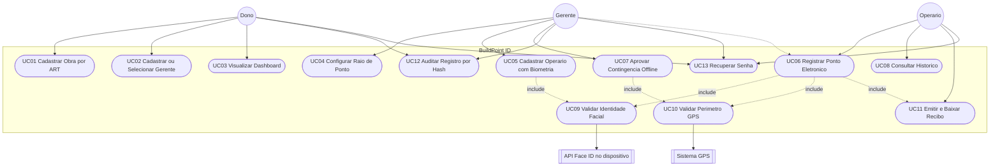

# Documento de Especificação de Requisitos — BuildPoint ID

**Plataforma de Gestão de Jornada de Trabalho na Construção Civil**
**Versão:** 1.2 (Etapa 3 — revisão pós-feedback)
**Equipe:** Emyliano, João Gabriel, Kelvin e Lucas Galindo
**Base:** Etapa 2 — [BuildPointIdAnexos](https://github.com/kelvinvass22/BuildPointIdAnexos/blob/etapa-2/README.md)
**Referências de produto:** [Figma — BuildPoint](https://www.figma.com/design/qdE18x1pR8N0mLXbiiba1i/BuildPoint) · [Gamma — BuildPoint ID](https://gamma.app/docs/BuildPoint-ID-tlfdcysve8uy1ji)

> **Nota de revisão (v1.2):** terminologia "Peão" → **Operário**; "Bater Ponto" → **Registrar Ponto**; requisitos de Segurança (RS) e de Interface (RI) foram incorporados às tabelas de RF/RNF como uma coluna **Categoria** (não são um novo tipo de requisito, só uma forma de filtrar); parâmetros numéricos (limites, sinais `>`/`<`/`≤`) saíram do texto da descrição e foram para uma coluna **Parâmetro**; toda linha de requisito agora tem **Critério de Aceitação**; RNF06 foi reescrito porque estava redigido como requisito funcional (procedimento, sem métrica/critério de aceite).

---

## 1. Introdução

### 1.1 Objetivo do documento

Este documento especifica os **requisitos funcionais** e **não funcionais** do sistema BuildPoint ID, o **diagrama de casos de uso** e as especificações textuais dos principais CDUs. Serve de base para o MVP e para a documentação da Etapa 3 (modelagem UML + branch `etapa-3` + PR), além de alimentar o quadro Kanban de macro-entregas (ver [`06-kanban-macro-entregas.md`](06-kanban-macro-entregas.md)).

### 1.2 Escopo do sistema

O BuildPoint ID é um sistema de **controle de ponto eletrônico descentralizado** para canteiros de obras. O MVP inclui:

- Painel Web corporativo (gestão macro);
- Aplicativos móveis para Gerente e Operário;
- Validação de presença por **reconhecimento facial** (processado no próprio dispositivo/hardware, com apenas o hash/vetor trafegando até o backend) e **cerca virtual (geofencing)**;
- Backend em **Django REST Framework**, documentado via **Swagger/OpenAPI**, com banco **PostgreSQL** hospedado no **Render** (mesmo ambiente do deploy).

**Fora do escopo do MVP:** folha de pagamento completa, emissão de holerites e gestão de benefícios (vale-transporte/alimentação).

> Sobre o cronograma da disciplina: o exemplo de "código em C++" citado no roteiro geral é apenas ilustrativo do professor. A equipe segue a stack já definida desde a Etapa 2: **Django REST Framework + Swagger, reconhecimento facial próprio/API gratuita compatível com o hardware do dispositivo, geolocalização nativa e PostgreSQL no Render (deploy também no Render)**.

### 1.3 Restrições legais

- Conformidade com a **Portaria 671/2021 do MTE** (registro de ponto eletrônico);
- Proteção de dados biométricos sensíveis conforme a **LGPD**;
- Identificação formal da obra por **ART (Anotação de Responsabilidade Técnica) do CREA**, e não por CNPJ — nem toda obra/canteiro possui CNPJ próprio, mas toda obra regular possui ART.

---

## 2. Descrição geral

### 2.1 Perspectiva do produto

| Camada | Tecnologia prevista | Uso |
| :--- | :--- | :--- |
| Painel Web | React/Next.js | Dono — obras, gerentes, dashboard |
| App móvel | React Native ou Flutter | Gerente e Operário — campo |
| Backend / API | **Django REST Framework** + **drf-spectacular (Swagger/OpenAPI)** | Regras de negócio, auth, geração de recibo/hash |
| Banco de dados | **PostgreSQL** (Render) | Persistência relacional |
| Reconhecimento facial | API própria (ou gratuita) executada **no hardware do dispositivo** | Gera vetor/hash facial localmente; backend só compara hashes |
| Geolocalização | GPS nativo do dispositivo | Geofencing |
| Deploy / Hospedagem | Render (API + banco) | Ambiente único para homologação e Etapa 3–5 |

### 2.2 Funções do produto

1. Gestão de obras (identificadas por ART do CREA) e alocação de um ou mais gerentes por especialidade;
2. Cadastro de trabalhadores operacionais (operários);
3. Criação de cerca virtual (raio do ponto);
4. Registro de ponto por biometria facial (processada no dispositivo) + checagem de perímetro GPS;
5. Emissão de recibo de ponto com hash verificável, para o operário e para auditoria;
6. Registro de ponto em contingência (offline), com aprovação posterior do gerente;
7. Consulta a relatórios de dias trabalhados e frequência.

### 2.3 Características dos usuários

| Perfil | Contexto | Necessidade principal |
| :--- | :--- | :--- |
| **Dono** | Escritório | Visão macro: dashboard de frequência, custos e obras |
| **Gerente da Obra** | Campo | Operacionalizar canteiro, raio do ponto, equipe local e contingência; pode ser responsável por mais de uma especialidade/obra |
| **Operário** | Campo | Interface mobile direta (≤ 2 cliques) para registrar ponto, baixar recibo e ver dias trabalhados |

---

## 3. Atores do sistema

| Ator | Tipo | Descrição |
| :--- | :--- | :--- |
| **Dono** | Primário | Administrador master no painel Web: obras, gerentes e dashboard |
| **Gerente** | Primário | Administrador de campo: cerca virtual, cadastro de operários, contingência offline. Uma obra pode ter **vários gerentes**, cada um com uma **especialidade** (ex.: elétrica, hidráulica, civil) |
| **Operário** | Primário | Trabalhador operacional: registra ponto por Face ID, baixa recibo e consulta histórico |
| **API Face ID** | Secundário (sistema, roda no dispositivo) | Processa vetores faciais localmente e gera o hash comparado pelo backend |
| **Sistema GPS / Geofencing** | Secundário (sistema) | Valida se o registro ocorre dentro do raio configurado da obra |

---

## 4. Diagrama de casos de uso

### 4.1 Mapa ator × caso de uso

| Caso de uso | Dono | Gerente | Operário | Sistema externo |
| :--- | :---: | :---: | :---: | :--- |
| UC01 Cadastrar Obra por ART | ● | | | |
| UC02 Cadastrar/Selecionar Gerente | ● | | | |
| UC03 Visualizar Dashboard | ● | | | |
| UC04 Configurar Raio de Ponto | | ● | | GPS |
| UC05 Cadastrar Operário com Biometria | | ● | | Face ID |
| UC06 Registrar Ponto Eletrônico | | ○ contingência | ● | Face ID + GPS |
| UC07 Aprovar Contingência Offline | | ● | | |
| UC08 Consultar Histórico | | | ● | |
| UC09 Validar Identidade Facial | | | | Face ID |
| UC10 Validar Perímetro GPS | | | | GPS |
| UC11 Emitir e Baixar Recibo | | | ● | |
| UC12 Auditar Registro por Hash | ● | ● | | |
| UC13 Recuperar Senha | ● | ● | ● | |

● = ator principal · ○ = ator secundário

---

## 5. Requisitos funcionais (RF)

> Colunas: **Categoria** é só um filtro (Core / Contingência / Auditoria / Conta), não um novo tipo de requisito. **Parâmetro** concentra qualquer número/limite/sinal — a descrição fica livre de `>`, `<`, `≤` soltos.

| ID | Descrição | Categoria | Ator | Prioridade | Parâmetro | Critério de aceitação | CDU |
| :--- | :--- | :--- | :--- | :--- | :--- | :--- | :--- |
| **RF01** | Permitir ao Dono cadastrar, editar e excluir canteiros de obras, identificados pela ART do CREA. | Core | Dono | Essencial | Campo obrigatório: nº da ART | O sistema não persiste a obra sem uma ART válida informada; um botão "+" permite adicionar quantas obras forem necessárias na sequência sem sair da tela. | UC01 |
| **RF02** | Permitir ao Dono vincular gerentes a uma obra, podendo **selecionar** um gerente já existente ou **cadastrar** um novo, e permitir mais de um gerente por obra (um por especialidade). | Core | Dono | Essencial | N:N entre Obra e Gerente | O formulário abre em modo "selecionar existente" por padrão; cadastrar um novo gerente é uma ação opcional, não obrigatória. Uma obra aceita múltiplos vínculos de gerente, cada um com uma especialidade. | UC02 |
| **RF03** | Disponibilizar dashboard com métricas de custos e frequência geral das obras. | Core | Dono | Importante | — | Dashboard carrega indicadores de todas as obras do Dono em uma única tela. | UC03 |
| **RF04** | Permitir ao Gerente delimitar o raio/perímetro (cerca virtual) para registro de ponto. | Core | Gerente | Essencial | Raio padrão configurável (ver RNF03) | Perímetro é salvo com centro (lat/long) e raio; alteração reflete no próximo registro de ponto. | UC04 |
| **RF05** | Permitir ao Gerente cadastrar dados e face inicial (enrolment) do Operário. | Core | Gerente | Essencial | — | Cadastro só é concluído após validação de qualidade da amostra facial (ver RNF09). | UC05 |
| **RF06** | Permitir ao Gerente aprovar, dentro do app, um registro de ponto feito em contingência offline (após o operário ter apresentado a evidência combinada, ex.: assinatura em papel). | Contingência | Gerente | Importante | — | Registro de contingência fica com status "pendente" até aprovação explícita do Gerente; após aprovada, gera recibo normalmente. | UC07 |
| **RF07** | Permitir ao Operário registrar ponto por reconhecimento facial no aplicativo móvel. | Core | Operário | Essencial | — | Toda tentativa de registro (aprovada ou recusada) fica registrada em log. | UC06 |
| **RF08** | Coletar e validar o GPS do dispositivo no momento do registro, bloqueando o registro quando fora do perímetro da obra. | Core | Operário / Sistema | Essencial | Ver RNF03 | Registro fora do raio configurado é rejeitado com mensagem explicativa e não gera recibo. | UC06, UC10 |
| **RF09** | Permitir ao Operário visualizar histórico de dias trabalhados e espelho de ponto. | Core | Operário | Essencial | — | Histórico exibido por período (mês corrente por padrão), com entrada/saída e total de horas. | UC08 |
| **RF10** | Emitir, para cada registro de ponto bem-sucedido, um recibo digital com hash de integridade, disponível para download pelo Operário. | Auditoria | Operário | Essencial | — | Recibo baixado localmente e o registro salvo no servidor compartilham o mesmo hash; qualquer divergência é sinalizada na tela de auditoria (RF11). | UC06, UC11 |
| **RF11** | Disponibilizar uma tela de auditoria/validação de registros, acessível por Dono, Gerente e Operário, mostrando dono, operário, gerente responsável, dispositivo usado, hash do recibo, login, data e horário do registro. | Auditoria | Dono, Gerente, Operário | Importante | — | Busca por operário, obra ou período retorna os metadados completos do registro e o resultado da comparação de hash. | UC12 |
| **RF12** | Permitir recuperação de senha ("Esqueci minha senha") para todos os perfis. | Conta | Dono, Gerente, Operário | Essencial | — | Fluxo de recuperação envia link/código e permite redefinição sem expor a senha atual. | UC13 |

---

## 6. Requisitos não funcionais (RNF)

> RS (segurança) e RI (interface) da versão anterior foram absorvidos aqui como **Categoria**. RNF06 foi reescrito: antes descrevia um comportamento sem métrica nem forma de verificar — agora tem parâmetro e critério de aceitação testável (ligado a RT01).

| ID | Descrição | Categoria | Parâmetro | Critério de aceitação |
| :--- | :--- | :--- | :--- | :--- |
| **RNF01** | O motor de registro e armazenamento de logs deve seguir a inviolabilidade exigida pela legislação de ponto eletrônico. | Segurança jurídica | Portaria 671/MTE | Log de marcação não permite update/delete via API; qualquer tentativa é rejeitada e auditada. |
| **RNF02** | O reconhecimento facial deve autenticar o operário com rapidez, tolerando variação de luminosidade do canteiro e uso parcial de EPIs (capacete, óculos). | Desempenho / IA | tempo máximo de resposta: 3 segundos | Em RT02, 95% das tentativas autenticam dentro do parâmetro, inclusive com sol forte, fim de tarde e uso de EPI. |
| **RNF03** | O geofencing deve validar a cerca virtual com margem de precisão estrita, para evitar fraude de localização. | Confiabilidade | raio padrão: 5 metros (configurável por obra) | Registro fora do parâmetro configurado é sempre bloqueado, confirmado em RT03. |
| **RNF04** | O backend deve garantir sincronização confiável das marcações; o app deve salvar ponto offline e sincronizar ao reconectar. | Arquitetura | fila de sincronização offline | Marcação feita sem conexão aparece como "pendente de sync" e migra para "sincronizada" assim que houver rede, sem perda de registro. |
| **RNF05** | A interface de registro de ponto do Operário deve ser rápida de operar. | Usabilidade | máximo de 2 cliques | Da tela inicial até a confirmação do registro, o fluxo feliz não excede o parâmetro. |
| **RNF06** | O sistema deve manter tempo de resposta estável mesmo sob concentração de registros no início de turno. | Disponibilidade | pico simulado: início de turno (07:00) | Em RT01, sob carga simulada, 95% das requisições respondem dentro do tempo definido para RNF02 e a taxa de erro fica dentro do limite acordado com a equipe antes do teste. |
| **RNF07** | Dados biométricos são tratados como dado sensível. | Privacidade | LGPD | Acesso ao vetor/hash facial é restrito por papel (RBAC) e nunca retornado em texto puro por endpoint de consulta. |
| **RNF08** | Controle de acesso por papéis, impedindo que Gerentes/Operários acessem o dashboard financeiro do Dono. | Segurança | RBAC | Requisição de um papel sem permissão ao endpoint financeiro retorna erro de autorização, nunca dado parcial. |
| **RNF09** | Não armazenar a foto de Face ID como imagem pura; guardar apenas hash/vetor criptografado. | Segurança | LGPD | Inspeção do banco/objeto de armazenamento não expõe nenhuma imagem de rosto em formato legível. |
| **RNF10** | Gerar log de auditoria imutável por registro de ponto: operário, data, horário, GPS e confiança do Face ID. | Segurança | sem alteração manual posterior | Log de auditoria não possui operação de edição exposta via API nem via painel administrativo. |
| **RNF11** | Recibo digital do operário e registro salvo no servidor devem ser verificáveis por hash. | Segurança / Auditoria | hash de integridade (ex.: SHA-256) | Comparação de hash na tela de auditoria (RF11) aponta "íntegro" ou "divergente" para qualquer recibo consultado. |
| **RNF12** | Tela de registro de ponto deve ter um botão central de destaque, em cor contrastante, para iniciar a câmera. | Interface | cor de destaque do design system (Action Blue) | Botão principal ocupa posição central e cor de CTA em todas as resoluções testadas. |
| **RNF13** | O app deve indicar visualmente a condição do GPS antes de permitir o clique de registro. | Interface | ícone de satélite (verde/vermelho) | Ícone reflete o estado real do GPS (dentro/fora do raio) antes de liberar o botão de registro. |
| **RNF14** | O Painel Web do Dono deve apresentar indicadores em formato gráfico, com design limpo e responsivo. | Interface | gráficos de pizza/barra | Dashboard se adapta a telas desktop e tablet sem quebra de layout, validado em pelo menos duas resoluções. |

---

## 7. Requisitos de testes (RT)

| ID | Descrição | Categoria | Critério de aceitação |
| :--- | :--- | :--- | :--- |
| **RT01** | Teste de estresse no pico de registros (ex.: início de turno). | Desempenho | Cobre RNF02 e RNF06 simultaneamente; relatório de carga anexado ao PR. |
| **RT02** | Teste de campo com sol forte, fim de tarde e uso de EPIs, para homologar a taxa de acerto do Face ID. | Desempenho / IA | Cobre RNF02; taxa de acerto e tempo médio documentados por cenário de luz/EPI. |
| **RT03** | Simulação de GPS spoofing para garantir bloqueio fora da cerca configurada. | Confiabilidade | Cobre RNF03; toda tentativa fora do raio é bloqueada nos casos testados. |
| **RT04** | Teste de integridade: comparar hash do recibo salvo no dispositivo (mesmo offline) com o hash persistido no backend após sincronização. | Auditoria | Cobre RF10/RNF11; qualquer divergência é sinalizada, nunca silenciada. |
| **RT05** | Teste do fluxo de contingência offline: registro sem conexão → evidência física (assinatura) → aprovação do Gerente no app. | Contingência | Cobre RF06; registro só conta como válido após aprovação explícita, nunca automaticamente. |

---

## 8. Especificações textuais de casos de uso

### UC01 — Cadastrar Obra por ART e Vincular Gerente

| Campo | Conteúdo |
| :--- | :--- |
| **Ator principal** | Dono |
| **Pré-condições** | Dono autenticado no painel Web. |
| **Pós-condições** | Obra persistida no banco (PostgreSQL/Render); gerente vinculado, se informado. |
| **Fluxo principal** | 1. Acessa menu **Obras**. 2. Clica **Cadastrar Nova Obra**. 3. Sistema exibe formulário (nome, endereço, coordenadas, nº da ART). 4. Dono escolhe **selecionar gerente existente** (padrão) ou **cadastrar novo**. 5. Clica **Salvar**. 6. Sistema valida, grava e confirma sucesso. 7. Botão "+" permite repetir o fluxo para outra obra sem sair da tela. |
| **Fluxos alternativos** | **4.a** Opta por cadastrar novo gerente → informa Nome/E-mail/CPF/especialidade e retorna com o gerente já selecionado. **6.a** Campos obrigatórios (incluindo ART) vazios → bloqueia salvamento e destaca em vermelho. |

### UC04 — Configurar Raio de Ponto (Geofencing)

| Campo | Conteúdo |
| :--- | :--- |
| **Ator principal** | Gerente |
| **Pré-condições** | Gerente logado no app e presente no canteiro. |
| **Pós-condições** | Cerca virtual da obra atualizada (centro + raio). |
| **Fluxo principal** | 1. Menu **Configurações da Obra**. 2. **Registrar Raio de Ponto**. 3. Sistema captura lat/long via GPS. 4. Confirma ponto central e raio. 5. **Salvar Perímetro**. 6. Sistema atualiza e confirma. |
| **Fluxos alternativos** | **3.a** GPS fraco/desativado → solicita alta precisão / céu aberto e volta ao passo 3. |

### UC05 — Cadastrar Operário com Biometria Facial

| Campo | Conteúdo |
| :--- | :--- |
| **Ator principal** | Gerente |
| **Pré-condições** | Gerente autenticado no app móvel. |
| **Pós-condições** | Operário cadastrado com hash facial válido. |
| **Fluxo principal** | 1. Aba **Trabalhadores** → **Cadastrar Operário**. 2. Informa Nome, CPF e Cargo. 3. **Capturar Biometria Facial**. 4. Abre câmera; processamento ocorre no próprio dispositivo. 5. Enquadra e captura. 6. Dispositivo extrai o vetor/hash local e valida qualidade. 7. **Concluir Cadastro**. 8. Envia apenas o hash ao backend, que persiste no banco. |
| **Fluxos alternativos** | **6.a** Pouca luz / rosto obstruído → aviso e retorno ao passo 4. |

### UC06 — Registrar Ponto Eletrônico

| Campo | Conteúdo |
| :--- | :--- |
| **Atores** | Operário (principal); Gerente (contingência) |
| **Pré-condições** | Operário cadastrado; app aberto. |
| **Pós-condições** | Recibo de ponto gerado com hash de integridade, ou registro offline pendente de aprovação do gerente. |
| **Fluxo principal** | 1. Clica **Registrar Ponto**. 2. Valida GPS dentro do raio. 3. Abre câmera frontal; face é processada no dispositivo. 4. Captura face e gera hash local. 5. Envia hash para o backend confirmar identidade. 6. Backend gera recibo com hash de integridade, salva log e retorna sucesso; app disponibiliza o recibo para download. |
| **Fluxos alternativos** | **2.a** Fora do raio → bloqueia. **5.a** Hash não confere → até 2 novas tentativas; depois orienta procurar o Gerente. **6.a** Sem internet → grava localmente (hash + evidência), fica pendente até aprovação do Gerente (UC07); recibo só é confirmado após sync. |

### UC07 — Aprovar Contingência Offline

| Campo | Conteúdo |
| :--- | :--- |
| **Ator principal** | Gerente |
| **Pré-condições** | Existe registro de ponto pendente feito offline pelo operário. |
| **Pós-condições** | Registro aprovado passa a gerar recibo válido; registro recusado é descartado com justificativa. |
| **Fluxo principal** | 1. Operário sem conexão solicita o registro; app grava localmente e orienta a colher uma evidência física (ex.: assinatura do Gerente em papel) até haver conexão. 2. Quando online, Gerente acessa **Contingências pendentes**. 3. Confere a evidência apresentada. 4. Aprova. 5. Sistema gera recibo com hash e sincroniza o registro. |
| **Fluxos alternativos** | **4.a** Gerente recusa → registro marcado como inválido, com motivo. |

### UC08 — Consultar Histórico de Dias Trabalhados

| Campo | Conteúdo |
| :--- | :--- |
| **Ator principal** | Operário |
| **Pré-condições** | Operário logado no app. |
| **Pós-condições** | Histórico do mês exibido (somente leitura). |
| **Fluxo principal** | 1. Menu **Dias Trabalhados**. 2. Sistema busca registros do CPF no mês. 3. Lista por data (entrada, saídas, total de horas). 4. Operário visualiza e pode baixar o recibo de qualquer registro. |
| **Fluxos alternativos** | **2.a** Sem registros → mensagem "Nenhum registro de ponto encontrado…". |

### UC11 — Emitir e Baixar Recibo

| Campo | Conteúdo |
| :--- | :--- |
| **Ator principal** | Operário |
| **Pré-condições** | Existe um registro de ponto concluído. |
| **Pós-condições** | Recibo (com hash) disponível para download local. |
| **Fluxo principal** | 1. A partir do histórico ou logo após o registro, Operário escolhe **Baixar Recibo**. 2. Sistema gera o arquivo com os dados do registro e o hash de integridade. 3. Operário salva o arquivo no dispositivo. |
| **Fluxos alternativos** | — |

### UC12 — Auditar Registro por Hash

| Campo | Conteúdo |
| :--- | :--- |
| **Atores** | Dono, Gerente |
| **Pré-condições** | Usuário autenticado com permissão de auditoria. |
| **Pós-condições** | Resultado da comparação de hash (íntegro/divergente) exibido com metadados completos. |
| **Fluxo principal** | 1. Acessa **Auditoria de Registros**. 2. Busca por operário, obra ou período. 3. Sistema exibe: dono, operário, gerente responsável, dispositivo, hash do recibo, login, data e horário. 4. Sistema compara o hash informado (ou o salvo) com o hash do backend e sinaliza o resultado. |
| **Fluxos alternativos** | **4.a** Hash divergente → registro é destacado para investigação. |

---

## 9. Rastreabilidade RF → CDU → Interface

| RF | CDU | Interface principal |
| :--- | :--- | :--- |
| RF01, RF02 | UC01, UC02 | Painel Web — Obras / Gerentes |
| RF03 | UC03 | Painel Web — Dashboard |
| RF04 | UC04 | App Gerente — Configurações |
| RF05 | UC05 | App Gerente — Trabalhadores |
| RF06 | UC07 | App Gerente — Contingência |
| RF07, RF08 | UC06, UC09, UC10 | App Operário — Registrar Ponto |
| RF09 | UC08 | App Operário — Dias Trabalhados |
| RF10, RF11 | UC11, UC12 | App/Painel — Recibo e Auditoria |
| RF12 | UC13 | Login — Esqueci minha senha |

---

## 10. Glossário

| Termo | Definição |
| :--- | :--- |
| **ART** | Anotação de Responsabilidade Técnica (CREA) — identifica formalmente a obra. |
| **Cerca virtual / Geofencing** | Perímetro geográfico onde o registro de ponto é permitido. |
| **Enrolment** | Cadastro inicial da biometria facial do operário. |
| **Face ID** | Motor de reconhecimento facial, executado no dispositivo. |
| **Recibo** | Comprovante do registro de ponto, com hash de integridade. |
| **Contingência offline** | Registro feito sem conexão, com aprovação posterior do Gerente. |
| **Log imutável** | Registro de ponto que não pode ser alterado após a gravação. |

---

*Documento revisado para a entrega da Etapa 3, incorporando o feedback de estrutura de requisitos, telas e stack (Django REST + PostgreSQL/Render).*
