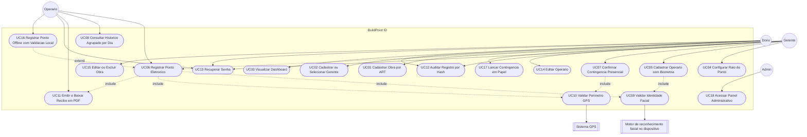

# Documento de Especificação de Requisitos — BuildPoint ID

**Plataforma de Gestão de Jornada de Trabalho na Construção Civil**
**Versão:** 1.3 (pós-Etapa 3 — expansão e alinhamento com o sistema implementado)
**Equipe:** Emyliano, João Gabriel, Kelvin e Lucas Galindo
**Base:** Etapa 2 — [BuildPointIdAnexos](https://github.com/kelvinvass22/BuildPointIdAnexos/blob/etapa-2/README.md)
**Referências de produto:** [Figma — BuildPoint](https://www.figma.com/design/qdE18x1pR8N0mLXbiiba1i/BuildPoint) · [Gamma — BuildPoint ID](https://gamma.app/docs/BuildPoint-ID-tlfdcysve8uy1ji)

> **Nota de revisão (v1.3):** a versão 1.2 já havia migrado a especificação de Node.js/Firebase para Django REST Framework/PostgreSQL. Esta revisão vai além: alinha o documento ao que **de fato foi implementado e testado em dispositivo real** (não só planejado), e adiciona **dez novos requisitos funcionais, quatro não funcionais e cinco novos casos de uso**, cobrindo funcionalidades que surgiram durante a implementação e validação prática do MVP — não estavam previstas nas versões anteriores porque só ficaram evidentes ao rodar o sistema de verdade com usuários reais (ver §1.4). Nada da v1.2 foi removido; onde uma descrição mudou de tecnologia (ex.: o motor de reconhecimento facial), o texto foi atualizado no lugar, e a mudança é explicada, não só declarada.

---

## 1. Introdução

### 1.1 Objetivo do documento

Este documento especifica os **requisitos funcionais** e **não funcionais** do sistema BuildPoint ID, o **diagrama de casos de uso** e as especificações textuais dos principais CDUs. Serve de base para o MVP e para a documentação da Etapa 3 (modelagem UML + branch `etapa-3` + PR), além de registrar a evolução do sistema até a versão apresentada.

### 1.2 Escopo do sistema

O BuildPoint ID é um sistema de **controle de ponto eletrônico descentralizado** para canteiros de obras. O MVP inclui:

- Painel Web corporativo (gestão macro);
- Aplicativo móvel único (React Native + Expo) com telas específicas para Dono, Gerente e Operário, de acordo com o papel autenticado;
- Validação de presença por **reconhecimento facial processado inteiramente no dispositivo** (rede neural local, sem envio de imagem ao servidor) e **cerca virtual (geofencing)**;
- Funcionamento **offline-first** na marcação de ponto: identidade e localização são validadas no aparelho mesmo sem internet, com sincronização e revalidação pelo backend assim que a conexão retornar;
- Backend em **Django REST Framework**, documentado via **Swagger/OpenAPI**, com banco **PostgreSQL**.

**Fora do escopo do MVP:** folha de pagamento completa, emissão de holerites e gestão de benefícios (vale-transporte/alimentação).

> Sobre o cronograma da disciplina: o exemplo de "código em C++" citado no roteiro geral é apenas ilustrativo do professor. A equipe segue a stack já definida desde a Etapa 2, com os ajustes registrados nesta revisão: **Django REST Framework + Swagger, reconhecimento facial por rede neural (MobileFaceNet/TFLite) rodando no próprio hardware do dispositivo, geolocalização nativa e PostgreSQL**.

### 1.3 Restrições legais

- Conformidade com a **Portaria 671/2021 do MTE** (registro de ponto eletrônico);
- Proteção de dados biométricos sensíveis conforme a **LGPD** — o vetor facial é armazenado **cifrado em repouso** (ver RNF15), nunca como imagem;
- Identificação formal da obra por **ART (Anotação de Responsabilidade Técnica) do CREA**, e não por CNPJ — nem toda obra/canteiro possui CNPJ próprio, mas toda obra regular possui ART.

### 1.4 Por que esta revisão existe

A v1.2 foi escrita com base no planejamento da Etapa 3. Entre a entrega da Etapa 3 e esta revisão, o sistema foi de fato implementado ponta a ponta e testado em campo (dispositivo Android real, com reconhecimento do próprio rosto da equipe e rejeição correta do rosto de uma pessoa não cadastrada). Esse teste real — e o retorno de quem for usar o sistema no dia a dia (gerente de obra, operário) — expôs lacunas que um documento de planejamento dificilmente antecipa sozinho:

- um cadastro de operário pode ficar "pela metade" se o cadastro de biometria for interrompido;
- um bug de exibição fazia o CPF aparecer no lugar do nome em alguns pontos da interface;
- pedir login toda vez que o app é reaberto é uma fricção desnecessária quando a sessão ainda é válida;
- um campo já modelado (`dispositivo_id`) nunca era de fato preenchido pelo app;
- o histórico ficava poluído com um cartão por marcação em vez de um por dia;
- faltava ao Gerente e ao Dono a capacidade de **corrigir** um cadastro já feito (de operário ou de obra), só de criar;
- o link de download do recibo em PDF não carregava a autenticação da API e caía na tela de erro.

Cada um desses pontos virou um requisito formal nesta revisão (RF13 a RF22, RNF15 a RNF18), em vez de ficar só documentado como "bug corrigido" num README técnico — é comportamento esperado do sistema, não só uma correção pontual.

---

## 2. Descrição geral

### 2.1 Perspectiva do produto

| Camada | Tecnologia (implementada) | Uso |
| :--- | :--- | :--- |
| Painel Web | React/Next.js (planejado para a próxima etapa) | Dono — obras, gerentes, dashboard |
| App móvel | **React Native + Expo**, com **Development Build (EAS)** — não roda no Expo Go, pois depende de módulos nativos (reconhecimento facial, armazenamento seguro) | Dono, Gerente e Operário — um único app, telas por papel |
| Backend / API | **Django REST Framework** + **drf-spectacular (Swagger/OpenAPI)** + **Simple JWT** (autenticação) | Regras de negócio, auth, geração de recibo/hash, auditoria |
| Banco de dados | **PostgreSQL** | Persistência relacional |
| Reconhecimento facial | **MobileFaceNet** (rede neural treinada com ArcFace loss), executado **no hardware do dispositivo** via **TensorFlow Lite** (`react-native-fast-tflite`) | Gera um embedding facial de 192 dimensões localmente; o backend só compara embeddings, nunca recebe imagem |
| Validação offline | Cache local cifrado do embedding autorizado (`expo-secure-store`) + comparação por similaridade de cosseno no próprio app | Permite confirmar (ou recusar) a identidade do Operário mesmo sem internet, antes mesmo de tentar sincronizar |
| Geolocalização | GPS nativo do dispositivo | Geofencing |
| Deploy / Hospedagem | **Em transição**: ambiente atual gerenciado (Render, PaaS); planejado migrar para uma **VPS Linux própria** (Nginx + Gunicorn) sem alterar o código da aplicação — ver RNF18 | Homologação e apresentação final |

### 2.2 Funções do produto

1. Gestão de obras (identificadas por ART do CREA), com edição e exclusão controlada, e alocação de um ou mais gerentes por especialidade;
2. Cadastro **e edição** de trabalhadores operacionais (operários), com conclusão condicionada à biometria;
3. Criação de cerca virtual (raio do ponto);
4. Registro de ponto por biometria facial (rede neural local) + checagem de perímetro GPS, com **validação de identidade totalmente offline** quando não há internet;
5. Emissão de recibo de ponto em PDF, com hash verificável, baixado de forma autenticada pelo próprio app;
6. Registro de ponto em contingência — tanto **presencial** (Gerente confirma a identidade na hora) quanto **em papel** (lançamento retroativo de uma batida anotada manualmente);
7. Consulta a relatórios de dias trabalhados e frequência, com histórico agrupado por dia;
8. Acesso administrativo restrito, sem tela no app, para suporte técnico.

### 2.3 Características dos usuários

| Perfil | Contexto | Necessidade principal |
| :--- | :--- | :--- |
| **Dono** | Escritório | Visão macro: dashboard de frequência, custos e obras; poder corrigir um cadastro de obra sem precisar recriar tudo |
| **Gerente da Obra** | Campo | Operacionalizar canteiro, raio do ponto, equipe local, contingência e correção de cadastro de operário; pode ser responsável por mais de uma especialidade/obra |
| **Operário** | Campo | Interface mobile direta (≤ 2 cliques) para registrar ponto — inclusive sem internet — baixar recibo e ver dias trabalhados agrupados por dia |
| **Admin (suporte técnico)** | Interno | Acesso de manutenção via painel administrativo do Django, sem necessidade de app próprio |

---

## 3. Atores do sistema

| Ator | Tipo | Descrição |
| :--- | :--- | :--- |
| **Dono** | Primário | Administrador master no painel Web: obras (criar, editar, excluir), gerentes e dashboard |
| **Gerente** | Primário | Administrador de campo: cerca virtual, cadastro e edição de operários, contingência (presencial e em papel). Uma obra pode ter **vários gerentes**, cada um com uma **especialidade** escolhida de um catálogo fixo (ex.: elétrica, hidráulica, civil) |
| **Operário** | Primário | Trabalhador operacional: registra ponto por reconhecimento facial (inclusive offline), baixa recibo e consulta histórico agrupado por dia |
| **Admin** | Primário (interno) | Suporte técnico com acesso ao painel administrativo do Django; **não possui tela no aplicativo móvel** — login mobile é recusado explicitamente para este papel |
| **Motor de reconhecimento facial (MobileFaceNet/TFLite)** | Secundário (sistema, roda no dispositivo) | Extrai o embedding facial localmente; o backend só compara embeddings recebidos |
| **Sistema GPS / Geofencing** | Secundário (sistema) | Valida se o registro ocorre dentro do raio configurado da obra |

---

## 4. Diagrama de casos de uso

> Este diagrama também existe como arquivo dedicado em [`diagramas/diagrama-casos-de-uso.md`](diagramas/diagrama-casos-de-uso.md) (artefato #2 da Etapa 3) — os dois são mantidos idênticos de propósito, para não haver duas versões divergentes do mesmo caso de uso.

### 4.1 Mapa ator × caso de uso

| Caso de uso | Dono | Gerente | Operário | Admin | Sistema externo |
| :--- | :---: | :---: | :---: | :---: | :--- |
| UC01 Cadastrar Obra por ART | ● | | | | |
| UC02 Cadastrar/Selecionar Gerente | ● | | | | |
| UC03 Visualizar Dashboard | ● | | | | |
| UC04 Configurar Raio de Ponto | | ● | | | GPS |
| UC05 Cadastrar Operário com Biometria | | ● | | | Motor facial |
| UC06 Registrar Ponto Eletrônico | | ○ contingência | ● | | Motor facial + GPS |
| UC07 Confirmar Contingência Presencial | | ● | | | |
| UC08 Consultar Histórico Agrupado por Dia | | | ● | | |
| UC09 Validar Identidade Facial | | | | | Motor facial |
| UC10 Validar Perímetro GPS | | | | | GPS |
| UC11 Emitir e Baixar Recibo em PDF | | | ● | | |
| UC12 Auditar Registro por Hash | ● | ● | | | |
| UC13 Recuperar Senha | ● | ● | ● | | |
| UC14 Editar Operário | | ● | | | |
| UC15 Editar ou Excluir Obra | ● | | | | |
| UC16 Registrar Ponto Offline com Validação Local | | | ● | | Motor facial (local) |
| UC17 Lançar Contingência em Papel | | ● | | | |
| UC18 Acessar Painel Administrativo | | | | ● | |

● = ator principal · ○ = ator secundário

---

## 5. Requisitos funcionais (RF)

> Colunas: **Categoria** é só um filtro (Core / Contingência / Auditoria / Conta / Administração), não um novo tipo de requisito. **Parâmetro** concentra qualquer número/limite/sinal — a descrição fica livre de `>`, `<`, `≤` soltos.

| ID | Descrição | Categoria | Ator | Prioridade | Parâmetro | Critério de aceitação | CDU |
| :--- | :--- | :--- | :--- | :--- | :--- | :--- | :--- |
| **RF01** | Permitir ao Dono cadastrar, editar e excluir canteiros de obras, identificados pela ART do CREA. | Core | Dono | Essencial | Campo obrigatório: nº da ART | O sistema não persiste a obra sem uma ART válida informada; um botão "+" permite adicionar quantas obras forem necessárias na sequência sem sair da tela. | UC01, UC15 |
| **RF02** | Permitir ao Dono vincular gerentes a uma obra, podendo **selecionar** um gerente já existente ou **cadastrar** um novo, e permitir mais de um gerente por obra (um por especialidade). | Core | Dono | Essencial | N:N entre Obra e Gerente | O formulário abre em modo "selecionar existente" por padrão; cadastrar um novo gerente é uma ação opcional, não obrigatória. Uma obra aceita múltiplos vínculos de gerente, cada um com uma especialidade. | UC02 |
| **RF03** | Disponibilizar dashboard com métricas de custos e frequência geral das obras. | Core | Dono | Importante | — | Dashboard carrega indicadores de todas as obras do Dono em uma única tela. | UC03 |
| **RF04** | Permitir ao Gerente delimitar o raio/perímetro (cerca virtual) para registro de ponto. | Core | Gerente | Essencial | Raio mínimo: 5 metros; máximo: 300 metros (ver RNF03) | Perímetro é salvo com centro (lat/long) e raio; alteração reflete no próximo registro de ponto; valores fora da faixa são rejeitados tanto na interface quanto na API. | UC04 |
| **RF05** | Permitir ao Gerente cadastrar dados e face inicial (enrolment) do Operário. | Core | Gerente | Essencial | — | Cadastro só é considerado **concluído** quando os dados cadastrais **e** a biometria facial estiverem salvos (ver RF14 sobre estado intermediário). | UC05 |
| **RF06** | Permitir ao Gerente confirmar, presencialmente e na hora, a identidade de um Operário cuja validação facial automática falhou, registrando o ponto em contingência. | Contingência | Gerente | Importante | — | Contingência presencial gera a marcação imediatamente, com o Gerente identificado como responsável (`registrado_por`); não existe estado de aprovação pendente separado — a confirmação do Gerente **é** o registro. | UC07 |
| **RF07** | Permitir ao Operário registrar ponto por reconhecimento facial no aplicativo móvel. | Core | Operário | Essencial | — | Toda tentativa de registro (aprovada ou recusada) fica registrada em log. | UC06 |
| **RF08** | Coletar e validar o GPS do dispositivo no momento do registro, bloqueando o registro quando fora do perímetro da obra. | Core | Operário / Sistema | Essencial | Ver RNF03 | Registro fora do raio configurado é rejeitado com mensagem explicativa e não gera recibo. | UC06, UC10 |
| **RF09** | Permitir ao Operário visualizar histórico de dias trabalhados e espelho de ponto. | Core | Operário | Essencial | — | Histórico exibido por período (mês corrente por padrão), com entrada/saída e total de horas. | UC08 |
| **RF10** | Emitir, para cada registro de ponto bem-sucedido, um recibo digital em PDF com hash de integridade, baixado pelo Operário de forma **autenticada** e disponível para abrir/compartilhar no próprio aparelho. | Auditoria | Operário | Essencial | — | Recibo baixado localmente e o registro salvo no servidor compartilham o mesmo hash; o download usa o token de sessão do Operário (nunca um link aberto sem autenticação); o app oferece abrir ou compartilhar o arquivo baixado. | UC06, UC11 |
| **RF11** | Disponibilizar uma tela de auditoria/validação de registros, acessível por Dono, Gerente e Operário, mostrando dono, operário, gerente responsável, dispositivo usado, hash do recibo, login, data e horário do registro. | Auditoria | Dono, Gerente, Operário | Importante | — | Busca por operário, obra ou período retorna os metadados completos do registro e o resultado da comparação de hash. | UC12 |
| **RF12** | Permitir recuperação de senha ("Esqueci minha senha") para todos os perfis. | Conta | Dono, Gerente, Operário | Essencial | — | Fluxo de recuperação envia link/código e permite redefinição sem expor a senha atual. | UC13 |
| **RF13** | Prover um papel administrativo (Admin) de suporte técnico, acessível **exclusivamente** pelo painel administrativo do backend, sem tela correspondente no aplicativo móvel. | Administração | Admin | Importante | — | Uma tentativa de login mobile com uma conta de papel Admin é recusada com mensagem explícita orientando o uso do painel administrativo; toda ação do Admin sobre dados de outros usuários fica registrada em log administrativo. | UC18 |
| **RF14** | Permitir ao Gerente (ou ao Dono) editar os dados cadastrais de um Operário já existente — cargo, tipo de vínculo, empresa terceirizada, endereço, data de admissão e e-mail —, preservando CPF e credenciais de acesso, e sinalizar visualmente quando um Operário está com o cadastro **incompleto** (dados salvos, mas sem biometria). | Core | Gerente, Dono | Essencial | Campos protegidos: CPF, senha | A edição não expõe nem altera CPF/senha; um Operário sem biometria cadastrada aparece destacado na lista do Gerente com uma ação direta para retomar o cadastro facial. | UC14, UC05 |
| **RF15** | Permitir ao Dono editar os dados de uma obra já cadastrada e excluí-la, impedindo a exclusão quando já existirem marcações de ponto registradas nela. | Core | Dono | Essencial | — | Tentativa de exclusão de uma obra com marcações retorna mensagem explicando o motivo e sugerindo encerrar a obra (mudar o status) em vez de apagá-la; edição preserva vínculos de gerente e histórico existentes. | UC15 |
| **RF16** | Atribuir a cada Gerente uma especialidade a partir de um **catálogo fixo** (não texto livre) — tanto como especialidade "padrão" do perfil quanto por obra, podendo o mesmo Gerente ter especialidades diferentes em obras diferentes. | Core | Dono | Importante | Catálogo com ao menos 14 especialidades (ex.: Obra, Civil/Estrutural, Elétrica, Hidráulica, Segurança do Trabalho, Qualidade) | A interface de cadastro/vínculo de gerente oferece uma lista fechada de opções; a API rejeita qualquer valor fora do catálogo. | UC02, UC14 |
| **RF17** | Registrar, em toda marcação de ponto (online, offline sincronizada ou em contingência), o identificador do dispositivo e o sistema operacional utilizados. | Auditoria | Sistema | Importante | — | Toda marcação bem-sucedida grava `dispositivo_id` e `sistema_operacional` sempre que o aparelho conseguir fornecê-los; esses dados aparecem na tela de auditoria (RF11). | UC06, UC07, UC16 |
| **RF18** | Apresentar ao Operário o histórico de marcações **agrupado por dia** — um único item por data, reunindo entrada, saída e intervalos daquele dia — em vez de um item por marcação individual. | Core | Operário | Importante | — | Cada dia com pelo menos uma marcação aparece como um único cartão na lista de histórico, com os horários daquele dia organizados lado a lado. | UC08 |
| **RF19** | Manter a sessão autenticada entre aberturas do aplicativo, evitando novo login enquanto a sessão for válida, e redirecionar automaticamente para a tela de login quando a sessão expirar ou for revogada. | Conta | Dono, Gerente, Operário | Essencial | — | Reabrir o app com uma sessão ainda válida leva direto à tela inicial do papel do usuário, sem pedir CPF/senha novamente; a expiração do token de sessão redireciona sozinho para o login, sem exigir que o usuário perceba o erro. | — |
| **RF20** | Permitir que um mesmo Gerente seja associado a mais de uma especialidade ao longo do tempo, sem perder o histórico das especialidades anteriores em cada obra. | Core | Dono, Gerente | Desejável | — | Uma alteração de especialidade em uma obra não apaga o registro histórico de vínculos anteriores daquele Gerente em outras obras. | UC02 |
| **RF21** | Permitir a validação da identidade facial e o registro do ponto **totalmente offline**, comparando o rosto capturado com o embedding facial autorizado armazenado localmente (cache cifrado no dispositivo), com sincronização e **revalidação pelo backend** assim que houver conexão. | Core | Operário | Essencial | Similaridade de cosseno, limiar calibrado (ver RNF02/RNF16) | Sem internet, o app informa na hora se a identidade foi confirmada ou recusada — nunca enfileira uma marcação sem antes validar localmente; ao sincronizar, o backend recompara e é a fonte de verdade final do registro. | UC16 |
| **RF22** | Permitir ao Gerente lançar retroativamente, no aplicativo, uma marcação registrada em papel quando o Operário esteve totalmente impossibilitado de usar o app no momento da batida, informando data/hora anotada e uma observação. | Contingência | Gerente | Desejável | — | O lançamento retroativo fica identificado como uma origem distinta da marcação (contingência em papel), nunca confundido com uma marcação feita pelo próprio Operário. | UC17 |

---

## 6. Requisitos não funcionais (RNF)

> RS (segurança) e RI (interface) da versão original foram absorvidos aqui como **Categoria**.

| ID | Descrição | Categoria | Parâmetro | Critério de aceitação |
| :--- | :--- | :--- | :--- | :--- |
| **RNF01** | O motor de registro e armazenamento de logs deve seguir a inviolabilidade exigida pela legislação de ponto eletrônico. | Segurança jurídica | Portaria 671/MTE | Log de marcação não permite update/delete via API; qualquer tentativa é rejeitada e auditada. |
| **RNF02** | O reconhecimento facial deve autenticar o operário com rapidez, tolerando variação de luminosidade do canteiro e uso parcial de EPIs (capacete, óculos). | Desempenho / IA | tempo máximo de resposta: 3 segundos; limiar de similaridade calibrado a partir de testes reais (≈0,875 de similaridade de cosseno para o modelo em uso) | Em RT02, 95% das tentativas autenticam dentro do parâmetro, inclusive com sol forte, fim de tarde e uso de EPI; validado em teste real com rosto próprio (aceito) e rosto de terceiro (rejeitado). |
| **RNF03** | O geofencing deve validar a cerca virtual com margem de precisão estrita, para evitar fraude de localização. | Confiabilidade | raio mínimo: 5 metros; máximo: 300 metros (configurável por obra dentro dessa faixa) | Registro fora do raio configurado é sempre bloqueado, confirmado em RT03; um raio configurado fora da faixa é rejeitado tanto no app quanto na API. |
| **RNF04** | O backend deve garantir sincronização confiável das marcações; o app deve validar e salvar o ponto offline e sincronizar ao reconectar. | Arquitetura | fila de sincronização offline | Marcação feita sem conexão só é enfileirada depois de confirmada localmente (RF21); aparece como "pendente de sync" e migra para "sincronizada" assim que houver rede, sem perda de registro. |
| **RNF05** | A interface de registro de ponto do Operário deve ser rápida de operar. | Usabilidade | máximo de 2 cliques | Da tela inicial até a confirmação do registro, o fluxo feliz não excede o parâmetro. |
| **RNF06** | O sistema deve manter tempo de resposta estável mesmo sob concentração de registros no início de turno. | Disponibilidade | pico simulado: início de turno (07:00) | Em RT01, sob carga simulada, 95% das requisições respondem dentro do tempo definido para RNF02 e a taxa de erro fica dentro do limite acordado com a equipe antes do teste. |
| **RNF07** | Dados biométricos são tratados como dado sensível. | Privacidade | LGPD | Acesso ao vetor/embedding facial é restrito por papel (RBAC) e nunca retornado em texto puro por endpoint de consulta, salvo para o próprio titular baixar seu embedding para uso offline (RF21). |
| **RNF08** | Controle de acesso por papéis, impedindo que Gerentes/Operários acessem o dashboard financeiro do Dono, e impedindo que o papel Admin acesse o aplicativo móvel. | Segurança | RBAC | Requisição de um papel sem permissão ao endpoint retorna erro de autorização, nunca dado parcial; login mobile de uma conta Admin é recusado (RF13). |
| **RNF09** | Não armazenar a foto de Face ID como imagem pura; guardar apenas o embedding facial. | Segurança | LGPD | Inspeção do banco/objeto de armazenamento não expõe nenhuma imagem de rosto em formato legível — apenas um vetor numérico cifrado (ver RNF15). |
| **RNF10** | Gerar log de auditoria imutável por registro de ponto: operário, data, horário, GPS e confiança do reconhecimento facial. | Segurança | sem alteração manual posterior | Log de auditoria não possui operação de edição exposta via API nem via painel administrativo. |
| **RNF11** | Recibo digital do operário e registro salvo no servidor devem ser verificáveis por hash. | Segurança / Auditoria | hash de integridade (SHA-256) | Comparação de hash na tela de auditoria (RF11) aponta "íntegro" ou "divergente" para qualquer recibo consultado. |
| **RNF12** | Tela de registro de ponto deve ter um botão central de destaque, em cor contrastante, para iniciar a câmera. | Interface | cor de destaque do design system (Action Blue) | Botão principal ocupa posição central e cor de CTA em todas as resoluções testadas. |
| **RNF13** | O app deve indicar visualmente a condição do GPS antes de permitir o clique de registro. | Interface | ícone de satélite (verde/vermelho) | Ícone reflete o estado real do GPS (dentro/fora do raio) antes de liberar o botão de registro. |
| **RNF14** | O Painel Web do Dono deve apresentar indicadores em formato gráfico, com design limpo e responsivo. | Interface | gráficos de pizza/barra | Dashboard se adapta a telas desktop e tablet sem quebra de layout, validado em pelo menos duas resoluções. |
| **RNF15** | O embedding facial deve ser armazenado **cifrado em repouso** no backend, não apenas anonimizado. | Segurança | criptografia simétrica autenticada (Fernet: AES-128-CBC + HMAC), chave gerenciada por variável de ambiente | Uma leitura direta da coluna no banco de dados não permite reconstruir o embedding sem a chave de cifragem, mantida fora do repositório de código. |
| **RNF16** | O reconhecimento facial deve usar um modelo de rede neural profunda para gerar o embedding facial, executado localmente no hardware do dispositivo — não uma heurística geométrica simples nem um serviço de nuvem por verificação. | Desempenho / IA | modelo MobileFaceNet (treinado com ArcFace loss), entrada 112×112×3, embedding de 192 dimensões, inferência via TensorFlow Lite | A comparação de identidade usa similaridade de cosseno entre embeddings L2-normalizados; nenhuma imagem ou frame de vídeo é enviado ao backend em nenhuma etapa. |
| **RNF17** | O aplicativo deve poder ser distribuído tanto como build de desenvolvimento (ligado à máquina do desenvolvedor) quanto como pacote standalone (autocontido), já que depende de módulos nativos incompatíveis com o Expo Go. | Portabilidade | perfis `development` e `preview`/`production` (EAS Build) | Um build gerado com o perfil `preview`/`production` funciona em qualquer aparelho sem exigir um servidor de desenvolvimento em execução. |
| **RNF18** | A infraestrutura de hospedagem do backend deve poder migrar de uma plataforma gerenciada (PaaS) para uma VPS Linux própria, sem exigir mudança de código — apenas de configuração de implantação. | Arquitetura / Infra | variáveis de ambiente (`DATABASE_URL`, `ALLOWED_HOSTS`, chave de cifragem), arquivos estáticos servidos via Whitenoise/Nginx, processo via Gunicorn | A aplicação sobe corretamente atrás de Nginx + Gunicorn numa VPS Linux, usando as mesmas variáveis de ambiente já previstas no código, sem nenhum recurso exclusivo do provedor gerenciado anterior. |

---

## 7. Requisitos de testes (RT)

| ID | Descrição | Categoria | Critério de aceitação |
| :--- | :--- | :--- | :--- |
| **RT01** | Teste de estresse no pico de registros (ex.: início de turno). | Desempenho | Cobre RNF02 e RNF06 simultaneamente; relatório de carga anexado ao PR. |
| **RT02** | Teste de campo com sol forte, fim de tarde e uso de EPIs, para homologar a taxa de acerto do reconhecimento facial. | Desempenho / IA | Cobre RNF02/RNF16; taxa de acerto e tempo médio documentados por cenário de luz/EPI. |
| **RT03** | Simulação de GPS spoofing para garantir bloqueio fora da cerca configurada. | Confiabilidade | Cobre RNF03; toda tentativa fora do raio é bloqueada nos casos testados. |
| **RT04** | Teste de integridade: comparar hash do recibo salvo no dispositivo (mesmo offline) com o hash persistido no backend após sincronização. | Auditoria | Cobre RF10/RNF11; qualquer divergência é sinalizada, nunca silenciada. |
| **RT05** | Teste do fluxo de contingência presencial: falha na validação facial automática → confirmação do Gerente no local. | Contingência | Cobre RF06; registro só existe com o Gerente explicitamente identificado como responsável. |
| **RT06** | Teste de validação offline: registrar ponto sem internet com (a) o próprio rosto do titular do embedding cacheado e (b) o rosto de outra pessoa — realizado em dispositivo real durante esta revisão. | Core / IA | Cobre RF21/RNF16; (a) confirma a identidade e enfileira a marcação; (b) recusa a identidade sem sequer enfileirar, informando o operário na hora. |
| **RT07** | Teste de exclusão de obra: tentar excluir uma obra sem marcações (deve funcionar) e uma obra com marcações já registradas (deve ser bloqueada com mensagem explicativa). | Confiabilidade | Cobre RF15; nenhuma marcação, log ou vínculo histórico é perdido em nenhum dos dois casos. |

---

## 8. Especificações textuais de casos de uso

### UC01 — Cadastrar Obra por ART e Vincular Gerente

| Campo | Conteúdo |
| :--- | :--- |
| **Ator principal** | Dono |
| **Pré-condições** | Dono autenticado no painel Web. |
| **Pós-condições** | Obra persistida no banco; gerente vinculado, se informado. |
| **Fluxo principal** | 1. Acessa menu **Obras**. 2. Clica **Cadastrar Nova Obra**. 3. Sistema exibe formulário (nome, endereço, coordenadas, nº da ART). 4. Dono escolhe **selecionar gerente existente** (padrão) ou **cadastrar novo**. 5. Clica **Salvar**. 6. Sistema valida, grava e confirma sucesso. 7. Botão "+" permite repetir o fluxo para outra obra sem sair da tela. |
| **Fluxos alternativos** | **4.a** Opta por cadastrar novo gerente → informa Nome/E-mail/CPF/especialidade (do catálogo fixo, RF16) e retorna com o gerente já selecionado. **6.a** Campos obrigatórios (incluindo ART) vazios → bloqueia salvamento e destaca em vermelho. |

### UC04 — Configurar Raio de Ponto (Geofencing)

| Campo | Conteúdo |
| :--- | :--- |
| **Ator principal** | Gerente |
| **Pré-condições** | Gerente logado no app e presente no canteiro. |
| **Pós-condições** | Cerca virtual da obra atualizada (centro + raio). |
| **Fluxo principal** | 1. Menu **Configurações da Obra**. 2. **Registrar Raio de Ponto**. 3. Sistema captura lat/long via GPS. 4. Confirma ponto central e raio (entre 5 e 300 m). 5. **Salvar Perímetro**. 6. Sistema atualiza e confirma. |
| **Fluxos alternativos** | **3.a** GPS fraco/desativado → solicita alta precisão / céu aberto e volta ao passo 3. |

### UC05 — Cadastrar Operário com Biometria Facial

| Campo | Conteúdo |
| :--- | :--- |
| **Ator principal** | Gerente |
| **Pré-condições** | Gerente autenticado no app móvel. |
| **Pós-condições** | Operário cadastrado com embedding facial válido — só então o cadastro é considerado concluído (RF14). |
| **Fluxo principal** | 1. Aba **Trabalhadores** → **Cadastrar Operário**. 2. Informa Nome, CPF e Cargo. 3. **Capturar Biometria Facial**. 4. Abre câmera; processamento ocorre no próprio dispositivo (MobileFaceNet/TFLite). 5. Enquadra e captura. 6. Dispositivo extrai o embedding local e valida qualidade da amostra. 7. **Concluir Cadastro**. 8. Envia apenas o embedding (nunca a imagem) ao backend, que persiste cifrado. |
| **Fluxos alternativos** | **6.a** Pouca luz / rosto obstruído → aviso e retorno ao passo 4. **7.a** Gerente sai da tela antes de concluir → sistema avisa que o cadastro ficará incompleto (sem biometria) e, se confirmado, o Operário aparece sinalizado como pendente na lista do Gerente (UC14). |

### UC06 — Registrar Ponto Eletrônico

| Campo | Conteúdo |
| :--- | :--- |
| **Atores** | Operário (principal); Gerente (contingência, UC07) |
| **Pré-condições** | Operário cadastrado com biometria concluída; app aberto. |
| **Pós-condições** | Recibo de ponto em PDF disponível, ou marcação offline validada localmente e pendente de sincronização (UC16). |
| **Fluxo principal** | 1. Clica **Registrar Ponto**. 2. Valida GPS dentro do raio. 3. Abre câmera frontal; rosto é processado no dispositivo. 4. Captura o rosto e gera o embedding local. 5. Envia o embedding para o backend confirmar identidade. 6. Backend gera o registro com hash de integridade, grava dispositivo/SO (RF17) e log, e retorna sucesso; app disponibiliza o recibo em PDF para download autenticado (RF10). |
| **Fluxos alternativos** | **2.a** Fora do raio → bloqueia. **5.a** Identidade não confirmada → orienta procurar o Gerente (UC07). **6.a** Sem internet → segue o fluxo de UC16 (validação e enfileiramento local, não um simples "salvar e torcer"). |

### UC07 — Confirmar Contingência Presencial

| Campo | Conteúdo |
| :--- | :--- |
| **Ator principal** | Gerente |
| **Pré-condições** | A validação facial automática do Operário falhou; Gerente está presente no local. |
| **Pós-condições** | Marcação registrada imediatamente, com o Gerente identificado como responsável. |
| **Fluxo principal** | 1. Gerente abre **Registrar Ponto da Equipe** (câmera com busca). 2. Localiza o Operário por nome ou CPF. 3. Confirma presencialmente a identidade. 4. Sistema valida o GPS do Gerente dentro do raio da obra. 5. Registra a marcação com `origem = CONTINGÊNCIA_GERENTE` e o Gerente como `registrado_por`. |
| **Fluxos alternativos** | — (não existe estado de aprovação pendente: a confirmação do Gerente já é o registro, ver §"Notas de alinhamento" no diagrama de classes). |

### UC08 — Consultar Histórico de Dias Trabalhados

| Campo | Conteúdo |
| :--- | :--- |
| **Ator principal** | Operário |
| **Pré-condições** | Operário logado no app. |
| **Pós-condições** | Histórico do mês exibido, agrupado por dia (RF18). |
| **Fluxo principal** | 1. Menu **Dias Trabalhados**. 2. Sistema busca registros do CPF no mês. 3. Lista **um cartão por dia**, reunindo entrada, saídas e intervalos daquela data. 4. Operário visualiza e pode baixar o recibo de qualquer marcação daquele dia. |
| **Fluxos alternativos** | **2.a** Sem registros → mensagem "Nenhum registro de ponto encontrado…". |

### UC11 — Emitir e Baixar Recibo em PDF

| Campo | Conteúdo |
| :--- | :--- |
| **Ator principal** | Operário |
| **Pré-condições** | Existe um registro de ponto concluído. |
| **Pós-condições** | Recibo em PDF baixado no aparelho, aberto ou compartilhado. |
| **Fluxo principal** | 1. A partir do histórico, Operário escolhe **Baixar Recibo**. 2. App baixa o PDF de forma **autenticada** (com o token de sessão, não um link aberto). 3. App oferece abrir o arquivo ou compartilhá-lo (ex.: WhatsApp, e-mail). |
| **Fluxos alternativos** | **2.a** Sessão expirada durante o download → app pede login novamente antes de tentar de novo, em vez de mostrar uma tela de erro genérica. |

### UC12 — Auditar Registro por Hash

| Campo | Conteúdo |
| :--- | :--- |
| **Atores** | Dono, Gerente |
| **Pré-condições** | Usuário autenticado com permissão de auditoria. |
| **Pós-condições** | Resultado da comparação de hash (íntegro/divergente) exibido com metadados completos. |
| **Fluxo principal** | 1. Acessa **Auditoria de Registros**. 2. Busca por operário, obra ou período. 3. Sistema exibe: dono, operário, gerente responsável, dispositivo, sistema operacional (RF17), hash do recibo, login, data e horário. 4. Sistema compara o hash informado (ou o salvo) com o hash do backend e sinaliza o resultado. |
| **Fluxos alternativos** | **4.a** Hash divergente → registro é destacado para investigação. |

### UC14 — Editar Operário

| Campo | Conteúdo |
| :--- | :--- |
| **Atores** | Gerente (principal), Dono |
| **Pré-condições** | Operário já cadastrado; usuário autenticado como Gerente da obra do operário (ou Dono). |
| **Pós-condições** | Dados cadastrais do Operário atualizados; CPF e senha permanecem inalterados. |
| **Fluxo principal** | 1. Gerente acessa a lista de operários da obra. 2. Seleciona um Operário e toca em **Editar**. 3. Altera cargo, tipo de vínculo, empresa terceirizada, endereço, data de admissão e/ou e-mail. 4. Salva. 5. Sistema confirma a atualização e registra a ação em log administrativo. |
| **Fluxos alternativos** | **1.a** Operário aparece sinalizado como "biometria pendente" (cadastro incompleto, ver UC05) → toque no destaque leva direto à captura de biometria em vez da edição de dados. |

### UC15 — Editar ou Excluir Obra

| Campo | Conteúdo |
| :--- | :--- |
| **Ator principal** | Dono |
| **Pré-condições** | Obra já cadastrada; Dono autenticado como proprietário da obra. |
| **Pós-condições** | Obra atualizada, ou excluída quando não houver marcações registradas nela. |
| **Fluxo principal** | 1. Dono acessa o detalhe da obra. 2. Edita nome, ART, endereço ou status, e salva — **ou** 3. Escolhe **Apagar obra**. 4. Sistema confirma a exclusão e remove a obra, junto dos vínculos de gerente associados (sem afetar operários ou marcações de outras obras). |
| **Fluxos alternativos** | **3.a** A obra já possui marcações de ponto registradas → sistema recusa a exclusão com uma mensagem explicando o motivo e sugerindo mudar o status da obra para "Encerrada" em vez de apagá-la. |

### UC16 — Registrar Ponto Offline com Validação Local

| Campo | Conteúdo |
| :--- | :--- |
| **Ator principal** | Operário |
| **Pré-condições** | Dispositivo sem conexão com a internet no momento da tentativa de registro; o app já baixou, em algum momento anterior com internet, o embedding facial autorizado do próprio Operário (cache local cifrado). |
| **Pós-condições** | Identidade confirmada localmente e marcação enfileirada para sincronização — ou identidade recusada localmente, sem nenhuma marcação enfileirada. |
| **Fluxo principal** | 1. Operário tenta registrar o ponto (UC06) e o app detecta ausência de conexão. 2. App captura o rosto e extrai o embedding localmente (mesmo motor de UC09, rodando offline). 3. App compara esse embedding com o cache local do próprio Operário por similaridade de cosseno. 4. Identidade confirmada → app informa o Operário na hora e enfileira a marcação (com a hora do próprio aparelho) para sincronizar assim que houver internet. 5. Ao sincronizar, o backend **revalida** a identidade e a localização — é ele quem decide definitivamente e grava a auditoria; a validação local é só feedback imediato. |
| **Fluxos alternativos** | **3.a** Similaridade abaixo do limiar → app recusa a identidade imediatamente, sem enfileirar nada, e orienta o Operário a tentar de novo com melhor enquadramento/iluminação. **1.a** Nunca houve download bem-sucedido do embedding cacheado (ex.: primeiro uso do aparelho sem internet) → app informa que é preciso se conectar à internet ao menos uma vez após o cadastro facial antes de bater ponto offline. |

### UC17 — Lançar Contingência em Papel

| Campo | Conteúdo |
| :--- | :--- |
| **Ator principal** | Gerente |
| **Pré-condições** | O Operário esteve impossibilitado de registrar o ponto pelo app no momento da batida (ex.: sem aparelho disponível) e anotou o horário em papel. |
| **Pós-condições** | Marcação registrada retroativamente, identificada como originada de contingência em papel. |
| **Fluxo principal** | 1. Gerente acessa **Lançamento retroativo**. 2. Seleciona o Operário e a obra. 3. Informa a data/hora anotada em papel e uma observação. 4. Confirma. 5. Sistema registra a marcação com essa origem específica, distinta de uma marcação feita pelo próprio Operário. |
| **Fluxos alternativos** | — |

### UC18 — Acessar Painel Administrativo

| Campo | Conteúdo |
| :--- | :--- |
| **Ator principal** | Admin (suporte técnico) |
| **Pré-condições** | Conta com papel Admin criada via linha de comando (`createsuperuser`). |
| **Pós-condições** | Acesso de manutenção aos dados do sistema pelo painel administrativo do Django. |
| **Fluxo principal** | 1. Admin acessa a URL do painel administrativo diretamente pelo navegador. 2. Autentica com usuário e senha. 3. Consulta ou ajusta dados conforme necessidade de suporte, dentro do que o painel expõe (marcações e logs de auditoria permanecem bloqueados para edição, por serem imutáveis por regra de negócio). |
| **Fluxos alternativos** | **1.a** Uma conta Admin tenta logar pelo aplicativo móvel em vez do painel → login é recusado com mensagem explicando que essa conta usa o painel administrativo, não o app. |

---

## 9. Rastreabilidade RF → CDU → Interface

| RF | CDU | Interface principal |
| :--- | :--- | :--- |
| RF01, RF02 | UC01, UC02 | Painel Web — Obras / Gerentes |
| RF03 | UC03 | Painel Web — Dashboard |
| RF04 | UC04 | App Gerente — Configurações |
| RF05, RF14 | UC05, UC14 | App Gerente — Trabalhadores |
| RF06 | UC07 | App Gerente — Contingência |
| RF07, RF08 | UC06, UC09, UC10 | App Operário — Registrar Ponto |
| RF09, RF18 | UC08 | App Operário — Dias Trabalhados |
| RF10, RF11 | UC11, UC12 | App/Painel — Recibo e Auditoria |
| RF12 | UC13 | Login — Esqueci minha senha |
| RF13 | UC18 | Painel Administrativo (Django Admin) |
| RF15, RF16, RF20 | UC15, UC02 | Painel Web — Obras / Gerentes |
| RF17 | UC06, UC07, UC16 | App — Registrar Ponto (todas as origens) |
| RF19 | — | App — inicialização |
| RF21 | UC16 | App Operário — Registrar Ponto (offline) |
| RF22 | UC17 | App Gerente — Lançamento retroativo |

---

## 10. Glossário

| Termo | Definição |
| :--- | :--- |
| **ART** | Anotação de Responsabilidade Técnica (CREA) — identifica formalmente a obra. |
| **Cerca virtual / Geofencing** | Perímetro geográfico onde o registro de ponto é permitido. |
| **Enrolment** | Cadastro inicial da biometria facial do operário. |
| **Embedding facial** | Vetor numérico (192 dimensões) que representa matematicamente um rosto, gerado por uma rede neural (MobileFaceNet); dois embeddings do mesmo rosto ficam próximos por similaridade de cosseno. |
| **Recibo** | Comprovante em PDF do registro de ponto, com hash de integridade, baixado de forma autenticada. |
| **Contingência presencial** | Registro validado na hora pelo Gerente, quando a validação facial automática falha. |
| **Contingência em papel** | Lançamento retroativo de uma batida anotada manualmente, quando o Operário não pôde usar o app no momento. |
| **Log imutável** | Registro de ponto que não pode ser alterado após a gravação. |
| **Papel Admin** | Conta de suporte técnico, sem tela no app, usada apenas no painel administrativo do backend. |
| **VPS** | Servidor virtual privado (infraestrutura própria), em contraste com uma plataforma gerenciada (PaaS) como o Render. |

---

*Documento revisado após a Etapa 3, incorporando o resultado do teste real do reconhecimento facial em dispositivo e o retorno de uso prático do sistema (Dono, Gerente e Operário).*
