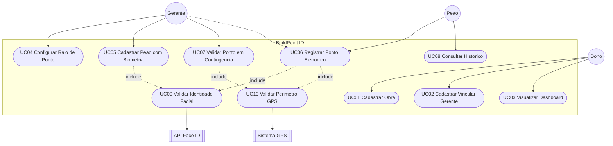

# Documento de Especificação de Requisitos — BuildPoint ID

**Plataforma de Gestão de Jornada de Trabalho na Construção Civil**  
**Versão:** 1.1 (Etapa 3)  
**Equipe:** Emyliano, João Gabriel, Kelvin e Lucas Galindo  
**Base:** Etapa 2 — [BuildPointIdAnexos](https://github.com/kelvinvass22/BuildPointIdAnexos/blob/etapa-2/README.md)  
**Referências de produto:** [Figma — BuildPoint](https://www.figma.com/design/qdE18x1pR8N0mLXbiiba1i/BuildPoint) · [Gamma — BuildPoint ID](https://gamma.app/docs/BuildPoint-ID-tlfdcysve8uy1ji)

---

## 1. Introdução

### 1.1 Objetivo do documento

Este documento especifica os **requisitos funcionais** e **não funcionais** do sistema BuildPoint ID, bem como o **diagrama de casos de uso** e as especificações textuais dos principais CDUs. Serve como base para o MVP e para a documentação da Etapa 3 (modelagem UML + branch `etapa-3` + PR).

### 1.2 Escopo do sistema

O BuildPoint ID é um sistema de **controle de ponto eletrônico descentralizado** para canteiros de obras da construção civil. O MVP inclui:

- Painel Web corporativo (gestão macro);
- Aplicativos móveis para Gerente e Peão;
- Validação de presença por **reconhecimento facial** e **cerca virtual (geofencing) de 5 metros**;
- Backend em Node.js com Firebase.

**Fora do escopo do MVP:** folha de pagamento completa, emissão de holerites e gestão de benefícios (vale-transporte/alimentação).

### 1.3 Restrições legais

- Conformidade com a **Portaria 671/2021 do MTE** (registro de ponto eletrônico);
- Proteção de dados biométricos sensíveis conforme a **LGPD**.

---

## 2. Descrição geral

### 2.1 Perspectiva do produto

Modelo híbrido:

| Camada | Tecnologia prevista | Uso |
| :--- | :--- | :--- |
| Painel Web | Frontend Web (ex.: React/Next.js) | Dono — obras, gerentes, dashboard |
| App móvel | React Native ou Flutter | Gerente e Peão — campo |
| Backend | Node.js + Firebase | API, auth, sync, logs |

### 2.2 Funções do produto

1. Gestão de obras por geolocalização e alocação de gerentes;
2. Cadastro de trabalhadores operacionais (peões);
3. Criação de cerca virtual (raio do ponto);
4. Registro de ponto por biometria facial + checagem de perímetro GPS;
5. Consulta a relatórios de dias trabalhados e frequência.

### 2.3 Características dos usuários

| Perfil | Contexto | Necessidade principal |
| :--- | :--- | :--- |
| **Dono** | Escritório | Visão macro: dashboard de frequência, custos e obras |
| **Gerente da Obra** | Campo | Operacionalizar canteiro, raio do ponto e equipe local |
| **Peão** | Campo | Interface mobile direta (≤ 2 cliques) para bater ponto e ver dias trabalhados |

---

## 3. Atores do sistema

| Ator | Tipo | Descrição |
| :--- | :--- | :--- |
| **Dono** | Primário | Administrador master no painel Web: obras, gerentes e dashboard |
| **Gerente** | Primário | Administrador de campo: cerca virtual, cadastro de peões e contingência de ponto |
| **Peão** | Primário | Trabalhador operacional: bate ponto por Face ID e consulta histórico |
| **API Face ID** | Secundário (sistema) | Processa vetores faciais e valida identidade |
| **Sistema GPS / Geofencing** | Secundário (sistema) | Valida se a marcação ocorre dentro do raio de 5 m |

---

## 4. Diagrama de casos de uso

> Diagrama completo e coerente com a Etapa 2 (critério da Etapa 3).

### 4.1 Mapa ator × caso de uso

| Caso de uso | Dono | Gerente | Peão | Sistema externo |
| :--- | :---: | :---: | :---: | :--- |
| UC01 Cadastrar Obra | ● | | | |
| UC02 Cadastrar / Vincular Gerente | ● | | | |
| UC03 Visualizar Dashboard | ● | | | |
| UC04 Configurar Raio de Ponto | | ● | | GPS |
| UC05 Cadastrar Peão com Biometria | | ● | | Face ID |
| UC06 Registrar Ponto Eletrônico | | ○ contingência | ● | Face ID + GPS |
| UC07 Validar Ponto em Contingência | | ● | | GPS |
| UC08 Consultar Histórico | | | ● | |
| UC09 Validar Identidade Facial | | | | Face ID |
| UC10 Validar Perímetro GPS | | | | GPS |

● = ator principal · ○ = ator secundário

---

## 5. Requisitos funcionais (RF)

| ID | Descrição | Ator | Prioridade | CDU relacionado |
| :--- | :--- | :--- | :--- | :--- |
| **RF01** | Permitir ao Dono o cadastro, edição e exclusão de canteiros de obras. | Dono | Essencial | UC01 |
| **RF02** | Permitir ao Dono cadastrar Gerentes de Obra e vinculá-los a obras específicas. | Dono | Essencial | UC02 |
| **RF03** | Disponibilizar dashboard com métricas de custos e frequência geral das obras. | Dono | Importante | UC03 |
| **RF04** | Permitir ao Gerente delimitar o raio/perímetro (cerca virtual de 5 m) para batida de ponto. | Gerente | Essencial | UC04 |
| **RF05** | Permitir ao Gerente cadastrar dados e face inicial (enrolment) do Peão. | Gerente | Essencial | UC05 |
| **RF06** | Permitir ao Gerente efetuar ou validar batida de ponto do peão em contingência. | Gerente | Importante | UC07 |
| **RF07** | Permitir ao Peão marcar ponto por reconhecimento facial (Face ID) no app móvel. | Peão | Essencial | UC06 |
| **RF08** | Coletar e validar GPS no momento da batida; bloquear se estiver fora do raio da obra. | Peão / Sistema | Essencial | UC06, UC10 |
| **RF09** | Permitir ao Peão visualizar histórico de dias trabalhados e espelho de ponto. | Peão | Essencial | UC08 |

---

## 6. Requisitos não funcionais (RNF)

| ID | Categoria | Descrição |
| :--- | :--- | :--- |
| **RNF01** | Segurança jurídica | Motor de registro e armazenamento de logs deve seguir a inviolabilidade exigida pela Portaria 671/MTE. |
| **RNF02** | Desempenho / IA | Face ID deve autenticar em até **3 segundos**, adaptável a luminosidade do canteiro e uso parcial de EPIs (capacete, óculos). |
| **RNF03** | Confiabilidade | Geofencing com margem estrita de **5 metros** para evitar fraudes de localização. |
| **RNF04** | Arquitetura | Backend Node.js + Firebase com sync em tempo real; app deve salvar ponto **offline** e sincronizar ao reconectar. |
| **RNF05** | Usabilidade | Batida de ponto do Peão em no máximo **2 cliques**. |
| **RNF06** | Disponibilidade | Sistema deve suportar pico de marcações no início de turno (ex.: 07:00) sem degradação perceptível. |
| **RNF07** | Privacidade | Dados biométricos tratados como sensíveis (LGPD); retenção e acesso mínimos necessários. |

---

## 7. Requisitos de interface (RI)

| ID | Descrição |
| :--- | :--- |
| **RI01** | Tela de batida do Peão com botão central em cor contrastante (ex.: verde) para iniciar a câmera. |
| **RI02** | Indicador visual de GPS (ícone satélite verde/vermelho) antes de permitir o clique de ponto. |
| **RI03** | Painel Web do Dono com gráficos (pizza/barras) de frequência e custos; design limpo e responsivo. |

---

## 8. Requisitos de segurança (RS)

| ID | Descrição |
| :--- | :--- |
| **RS01** | Controle de acesso por papéis (RBAC): Peões/Gerentes não acessam dashboard financeiro do Dono. |
| **RS02** | Fotos de Face ID não são salvas como imagem pura; armazenar apenas hash/vetor facial criptografado (LGPD). |
| **RS03** | Log de auditoria imutável por batida: ID do trabalhador, data, horário, GPS e confiança do Face ID — sem alteração manual posterior. |

---

## 9. Requisitos de testes (RT)

| ID | Descrição |
| :--- | :--- |
| **RT01** | Testes de estresse no pico de batidas (ex.: entrada às 07:00) no backend Node.js/Firebase. |
| **RT02** | Testes de campo com sol forte, fim de tarde e EPIs para homologar taxa de acerto do Face ID. |
| **RT03** | Simulação de GPS spoofing para garantir bloqueio fora da cerca de 5 m. |

---

## 10. Especificações textuais de casos de uso (mín. 3)

### UC01 — Cadastrar Obra e Vincular Gerente

| Campo | Conteúdo |
| :--- | :--- |
| **Ator principal** | Dono |
| **Pré-condições** | Dono autenticado no painel Web. |
| **Pós-condições** | Obra persistida no Firebase; gerente vinculado (se informado). |
| **Fluxo principal** | 1. Acessa menu **Obras**. 2. Clica **Cadastrar Nova Obra**. 3. Sistema exibe formulário (nome, endereço, coordenadas). 4. Preenche e seleciona Gerente. 5. Clica **Salvar**. 6. Sistema valida, grava e confirma sucesso. |
| **Fluxos alternativos** | **4.a** Gerente inexistente → cadastra Nome/E-mail/CPF e retorna com gerente selecionado. **6.a** Campos obrigatórios vazios → bloqueia salvamento e destaca em vermelho. |

### UC04 — Configurar Raio de Ponto (Geofencing)

| Campo | Conteúdo |
| :--- | :--- |
| **Ator principal** | Gerente |
| **Pré-condições** | Gerente logado no app e presente no canteiro. |
| **Pós-condições** | Cerca virtual da obra atualizada (centro + raio, padrão 5 m). |
| **Fluxo principal** | 1. Menu **Configurações da Obra**. 2. **Registrar Raio de Ponto**. 3. Sistema captura lat/long via GPS. 4. Confirma ponto central e raio (5 m). 5. **Salvar Perímetro**. 6. Sistema atualiza e confirma. |
| **Fluxos alternativos** | **3.a** GPS fraco/desativado (erro > 10 m) → solicita alta precisão / céu aberto e volta ao passo 3. |

### UC05 — Cadastrar Peão com Biometria Facial

| Campo | Conteúdo |
| :--- | :--- |
| **Ator principal** | Gerente |
| **Pré-condições** | Gerente autenticado no app móvel. |
| **Pós-condições** | Peão cadastrado com vetor facial válido. |
| **Fluxo principal** | 1. Aba **Trabalhadores** → **Cadastrar Peão**. 2. Informa Nome, CPF e Cargo. 3. **Capturar Biometria Facial**. 4. Abre câmera. 5. Enquadra e captura. 6. Extrai vetores e valida qualidade. 7. **Concluir Cadastro**. 8. Persiste no Firebase. |
| **Fluxos alternativos** | **6.a** Pouca luz / rosto obstruído → aviso e retorno ao passo 4. |

### UC06 — Registrar Ponto Eletrônico

| Campo | Conteúdo |
| :--- | :--- |
| **Atores** | Peão (principal); Gerente (contingência) |
| **Pré-condições** | Peão cadastrado; app aberto. |
| **Pós-condições** | Bilhete de ponto gerado com log imutável (Portaria 671) ou registro offline pendente de sync. |
| **Fluxo principal** | 1. Clica **Bater Ponto**. 2. Valida GPS dentro de 5 m. 3. Abre câmera frontal. 4. Captura face. 5. Confirma identidade ≤ 3 s. 6. Gera bilhete, salva log e exibe sucesso. |
| **Fluxos alternativos** | **2.a** Fora do raio → bloqueia. **5.a** Face não confere → até 2 novas tentativas; depois orienta procurar Gerente. **6.a** Sem internet → grava offline criptografado e sincroniza depois. |

### UC08 — Consultar Histórico de Dias Trabalhados

| Campo | Conteúdo |
| :--- | :--- |
| **Ator principal** | Peão |
| **Pré-condições** | Peão logado no app. |
| **Pós-condições** | Histórico do mês exibido (somente leitura). |
| **Fluxo principal** | 1. Menu **Dias Trabalhados**. 2. Sistema busca pontos do CPF no mês. 3. Lista por data (entrada, saídas, total de horas). 4. Peão visualiza. |
| **Fluxos alternativos** | **2.a** Sem registros → mensagem “Nenhum registro de ponto encontrado…”. |

---

## 11. Rastreabilidade RF → CDU → Interface

| RF | CDU | Interface principal |
| :--- | :--- | :--- |
| RF01, RF02 | UC01, UC02 | Painel Web — Obras / Gerentes |
| RF03 | UC03 | Painel Web — Dashboard |
| RF04 | UC04 | App Gerente — Configurações |
| RF05 | UC05 | App Gerente — Trabalhadores |
| RF06 | UC07 | App Gerente — Contingência |
| RF07, RF08 | UC06, UC09, UC10 | App Peão — Bater Ponto |
| RF09 | UC08 | App Peão — Dias Trabalhados |

---

## 12. Glossário

| Termo | Definição |
| :--- | :--- |
| **Cerca virtual / Geofencing** | Perímetro geográfico (raio de 5 m) onde a batida de ponto é permitida. |
| **Enrolment** | Cadastro inicial da biometria facial do peão. |
| **Face ID** | Motor de reconhecimento facial por vetores. |
| **Log imutável** | Registro de ponto que não pode ser alterado após a gravação. |
| **REP-P** | Registrador Eletrônico de Ponto via Programa (Portaria 671). |

---

*Documento preparado para entrega da Etapa 3 — coerente com a especificação da Etapa 2.*
