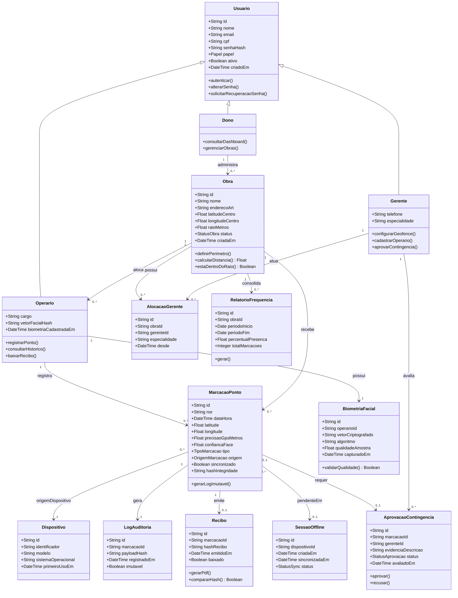

# Diagrama de Classes — BuildPoint ID

**Versão:** 1.1 (Etapa 3 — revisão pós-feedback)

Mudanças desta revisão:
- `Peão` → **`Operario`** em todo o modelo.
- `Obra` × `Gerente` deixou de ser 1:1 e virou **N:N via `AlocacaoGerente`** (uma obra pode ter vários gerentes, cada um responsável por uma especialidade — elétrica, hidráulica, civil etc.).
- Novas classes `Recibo`, `Dispositivo` e `AprovacaoContingencia` para suportar recibo com hash, metadados de auditoria e o fluxo de contingência offline com assinatura.
- Persistência agora é **PostgreSQL** (Render); os tipos permanecem os mesmos, sem acoplamento a um banco específico no modelo.

## Diagrama (Mermaid)

## Multiplicidades e regras

| Relacionamento | Multiplicidade | Regra de negócio |
| :--- | :--- | :--- |
| Dono → Obra | 1 : 0..\* | Um dono administra várias obras |
| Obra → AlocacaoGerente | 1 : 0..\* | Uma obra pode ter vários gerentes, um por especialidade |
| Gerente → AlocacaoGerente | 1 : 0..\* | Um gerente pode atuar em mais de uma obra |
| Obra → Operário | 1 : 0..\* | Obra possui vários operários alocados |
| Operário → BiometriaFacial | 1 : 1 | Um vetor facial ativo por operário (LGPD: sem foto pura) |
| Operário → MarcacaoPonto | 1 : 0..\* | Histórico de registros do trabalhador |
| Obra → MarcacaoPonto | 1 : 0..\* | Todas as marcações pertencem a uma obra |
| MarcacaoPonto → LogAuditoria | 1 : 1 | Todo registro gera log imutável |
| MarcacaoPonto → Recibo | 1 : 0..1 | Recibo só existe quando o registro é confirmado |
| MarcacaoPonto → SessaoOffline | 0..\* : 0..1 | Registros offline ficam pendentes até sync |
| MarcacaoPonto → AprovacaoContingencia | 0..1 : 0..1 | Só existe quando o registro nasce em contingência |

## Enumerações

| Enum | Valores |
| :--- | :--- |
| `Papel` | DONO, GERENTE, OPERARIO |
| `StatusObra` | ATIVA, PAUSADA, ENCERRADA |
| `TipoMarcacao` | ENTRADA, SAIDA, INTERVALO_INICIO, INTERVALO_FIM |
| `OrigemMarcacao` | APP_OPERARIO, CONTINGENCIA_GERENTE, SYNC_OFFLINE |
| `StatusSync` | PENDENTE, SINCRONIZADO, FALHA |
| `StatusAprovacao` | PENDENTE, APROVADA, RECUSADA |

## Observações de modelagem

- `vetorFacialHash` / `vetorCriptografado`: só o hash trafega e é persistido — o processamento da imagem acontece no dispositivo (RNF09).
- `nsr` + `hashIntegridade` (em `MarcacaoPonto` e `Recibo`): suportam a comparação de hash exigida pela tela de auditoria (RF11/RF12).
- `raioMetros` é atributo de `Obra`, não uma constante fixa no código — permite raio diferente por canteiro (RNF03).
- `AlocacaoGerente` resolve a relação N:N entre `Obra` e `Gerente` com a especialidade como atributo da associação.
- Herança `Usuario` → papéis implementa o RBAC (RNF08).