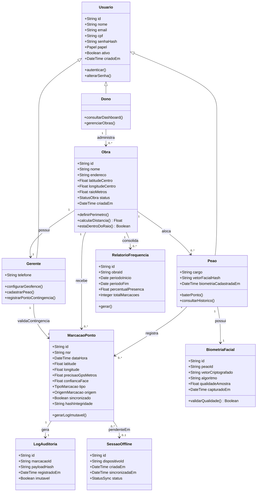

# Diagrama de Classes — BuildPoint ID

Modelo de domínio do MVP com entidades, atributos, relacionamentos e multiplicidades.

## Diagrama (Mermaid)

## Multiplicidades e regras

| Relacionamento | Multiplicidade | Regra de negócio |
| :--- | :--- | :--- |
| Dono → Obra | 1 : 0..\* | Um dono administra várias obras |
| Obra → Gerente | 1 : 1 | Cada obra tem um gerente responsável no MVP |
| Obra → Peão | 1 : 0..\* | Obra possui vários peões alocados |
| Peão → BiometriaFacial | 1 : 1 | Um vetor facial ativo por peão (LGPD: sem foto pura) |
| Peão → MarcacaoPonto | 1 : 0..\* | Histórico de batidas do trabalhador |
| Obra → MarcacaoPonto | 1 : 0..\* | Todas as batidas pertencem a uma obra |
| MarcacaoPonto → LogAuditoria | 1 : 1 | Toda batida gera log imutável (Portaria 671) |
| MarcacaoPonto → SessaoOffline | 0..\* : 0..1 | Batidas offline ficam pendentes até sync |

## Enumerações

| Enum | Valores |
| :--- | :--- |
| `Papel` | DONO, GERENTE, PEAO |
| `StatusObra` | ATIVA, PAUSADA, ENCERRADA |
| `TipoMarcacao` | ENTRADA, SAIDA, INTERVALO_INICIO, INTERVALO_FIM |
| `OrigemMarcacao` | APP_PEAO, CONTINGENCIA_GERENTE, SYNC_OFFLINE |
| `StatusSync` | PENDENTE, SINCRONIZADO, FALHA |

## Observações de modelagem

- `vetorFacialHash` / `vetorCriptografado`: atende **RS02** (não armazenar imagem pura).
- `nsr` + `hashIntegridade`: suportam rastreabilidade estilo REP-P / **RNF01**.
- `raioMetros` padrão **5.0** (**RNF03**).
- Herança `Usuario` → papéis implementa **RS01** (RBAC).
