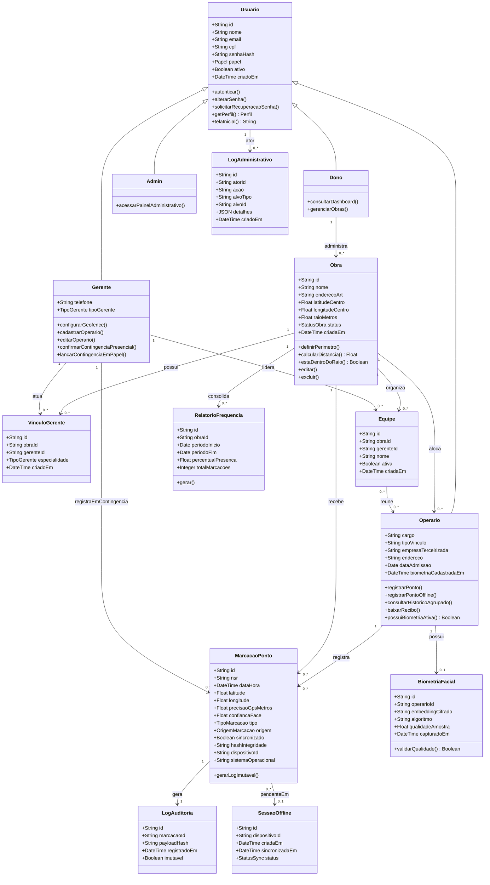

# Diagrama de Classes — BuildPoint ID

**Versão:** 1.2 (pós-Etapa 3 — alinhado ao código implementado)

Mudanças desta revisão:

- `AlocacaoGerente` → renomeada para **`VinculoGerente`**, para bater exatamente com o nome usado no código (`obras.models.VinculoGerente`) — evita um diagrama que "parece" outra classe na hora de conferir com a implementação.
- Novo enum **`TipoGerente`** (catálogo fixo de ~15 especialidades) e novo valor **`ADMIN`** em `Papel` — funciona como uma sub-role dentro do papel Gerente (RF16) e como papel de suporte técnico sem tela no app (RF13).
- Nova classe **`LogAdministrativo`**: toda ação de edição/remoção feita por Gerente/Dono sobre dados de outro usuário (editar operário, apagar obra, remover operário) fica registrada aqui — não só a marcação de ponto tinha auditoria; agora as ações administrativas também têm.
- Nova classe **`Equipe`**: agrupamento de operários dentro de uma obra, liderado por um Gerente (suporta a tela "Organizar equipes").
- **`AprovacaoContingencia` removida** e **`Recibo`/`Dispositivo` simplificadas** — ver "Notas de alinhamento com a implementação real" abaixo. Isso não é uma perda de modelagem: é o diagrama registrando, de forma explícita, uma decisão de design tomada durante a implementação, em vez de manter um desenho que a Etapa 3 previu mas o sistema real não construiu daquela forma.
- Persistência em **PostgreSQL**; os tipos permanecem os mesmos, sem acoplamento a um banco específico no modelo.

## Diagrama (Mermaid)

## Multiplicidades e regras

| Relacionamento | Multiplicidade | Regra de negócio |
| :--- | :--- | :--- |
| Dono → Obra | 1 : 0..\* | Um dono administra várias obras; pode editar e excluir (RF15), exceto quando há marcações registradas |
| Obra → VinculoGerente | 1 : 0..\* | Uma obra pode ter vários gerentes, cada um com uma especialidade do catálogo `TipoGerente` (RF16) |
| Gerente → VinculoGerente | 1 : 0..\* | Um gerente pode atuar em mais de uma obra, com especialidades diferentes em cada uma (RF20) |
| Obra → Operário | 1 : 0..\* | Obra possui vários operários alocados; Gerente/Dono podem editar o cadastro (RF14) |
| Obra → Equipe | 1 : 0..\* | Equipes agrupam operários dentro de uma obra, cada uma liderada por um Gerente |
| Operário → BiometriaFacial | 1 : 0..1 | Um operário **pode não ter** biometria ainda — é exatamente o estado "cadastro incompleto" descrito em RF14; o cadastro só é considerado concluído quando essa relação existe |
| Operário → MarcacaoPonto | 1 : 0..\* | Histórico de registros do trabalhador, incluindo os feitos offline (RF21) |
| Obra → MarcacaoPonto | 1 : 0..\* | Todas as marcações pertencem a uma obra; por isso uma obra com marcações não pode ser excluída (RF15) |
| MarcacaoPonto → LogAuditoria | 1 : 1 | Todo registro gera log imutável |
| MarcacaoPonto → SessaoOffline | 0..\* : 0..1 | Registros offline ficam pendentes até sync; a validação de identidade já ocorreu no dispositivo antes de chegar aqui (RF21) |
| Gerente → MarcacaoPonto (contingência) | 1 : 0..\* | Toda marcação de contingência (presencial ou em papel) tem um Gerente como `registrado_por` |
| Usuario → LogAdministrativo | 1 : 0..\* | Qualquer usuário com permissão de edição/exclusão gera um log administrativo ao agir sobre outro registro |

## Enumerações

| Enum | Valores |
| :--- | :--- |
| `Papel` | DONO, GERENTE, OPERARIO, **ADMIN** |
| `TipoGerente` | OBRA, CIVIL_ESTRUTURAL, ELETRICA, HIDRAULICA, SEGURANCA_TRABALHO, QUALIDADE, PLANEJAMENTO, SUPRIMENTOS, MANUTENCAO, AMBIENTAL, FINANCEIRO, RECURSOS_HUMANOS, COMERCIAL, GERAL, OUTRO |
| `StatusObra` | ATIVA, PAUSADA, ENCERRADA |
| `TipoMarcacao` | ENTRADA, SAIDA, INTERVALO_INICIO, INTERVALO_FIM |
| `OrigemMarcacao` | APP_OPERARIO, CONTINGENCIA_GERENTE, CONTINGENCIA_PAPEL, SYNC_OFFLINE |
| `StatusSync` | PENDENTE, SINCRONIZADO, FALHA |

## Observações de modelagem

- `embeddingCifrado`: só um vetor numérico cifrado (Fernet) trafega e é persistido — o processamento da imagem acontece inteiramente no dispositivo (RNF09, RNF15, RNF16); a foto em si nunca sai do aparelho.
- `algoritmo` (em `BiometriaFacial`): identifica qual modelo gerou aquele embedding (ex.: `mobilefacenet-tflite-v1`) — existe justamente para permitir trocar de modelo no futuro sem invalidar silenciosamente embeddings antigos.
- `nsr` + `hashIntegridade` (em `MarcacaoPonto`): suportam a comparação de hash exigida pela tela de auditoria (RF11/RF12), sem precisar de uma tabela `Recibo` separada — o PDF é gerado sob demanda a partir da própria marcação (ver nota abaixo).
- `dispositivoId` + `sistemaOperacional`: atributos diretos de `MarcacaoPonto` (RF17), não uma classe `Dispositivo` à parte — ver nota abaixo.
- `raioMetros` é atributo de `Obra`, não uma constante fixa no código — permite raio diferente por canteiro (RNF03).
- `VinculoGerente` resolve a relação N:N entre `Obra` e `Gerente` com a especialidade (`TipoGerente`) como atributo da associação.
- Herança `Usuario` → papéis implementa o RBAC (RNF08); `Admin` é um papel de herança formal, mesmo sem UI própria no app.

## Notas de alinhamento com a implementação real

A Etapa 3 modelou três classes que a implementação final simplificou de propósito. Registrar isso explicitamente é mais honesto do que manter um diagrama "aspiracional" que não bate com o sistema que roda de verdade:

1. **`AprovacaoContingencia` (removida).** O modelo original previa um fluxo com estado — operário registra offline, apresenta uma evidência física, e só depois o Gerente aprova ou recusa (`PENDENTE` → `APROVADA`/`RECUSADA`). Na prática, a contingência implementada é **imediata**: o Gerente confirma a identidade presencialmente e a marcação já nasce válida, com ele como responsável (`registrado_por`). Não existe um estado intermediário "aguardando aprovação" porque, no fluxo real de canteiro, o Gerente só usa a contingência quando já está ao lado do operário — a aprovação e a confirmação são o mesmo instante. O que a Etapa 3 chamava de "contingência offline com aprovação posterior" virou, na implementação, dois casos de uso distintos e mais simples: UC07 (contingência presencial, imediata) e UC17 (contingência em papel, lançamento retroativo pelo Gerente).
2. **`Recibo` (removida como entidade persistida).** Em vez de uma tabela própria com `hashRecibo`/`emitidoEm`/`baixado`, o recibo é um **PDF gerado sob demanda** a partir dos dados já existentes em `MarcacaoPonto` (que já carrega `hashIntegridade`). Criar uma tabela separada só para guardar o mesmo hash duas vezes seria redundância sem benefício de auditoria adicional.
3. **`Dispositivo` (removida como entidade própria).** Em vez de uma tabela de dispositivos com `identificador`/`modelo`/`primeiroUsoEm`, os campos `dispositivo_id` e `sistema_operacional` foram implementados diretamente em `MarcacaoPonto` (RF17). Um canteiro de obra não reutiliza o mesmo aparelho entre operários diferentes com frequência suficiente para justificar uma entidade "Dispositivo" com ciclo de vida próprio — o que importa para auditoria é *qual* dispositivo fez *aquela* marcação, não manter um cadastro de aparelhos.
