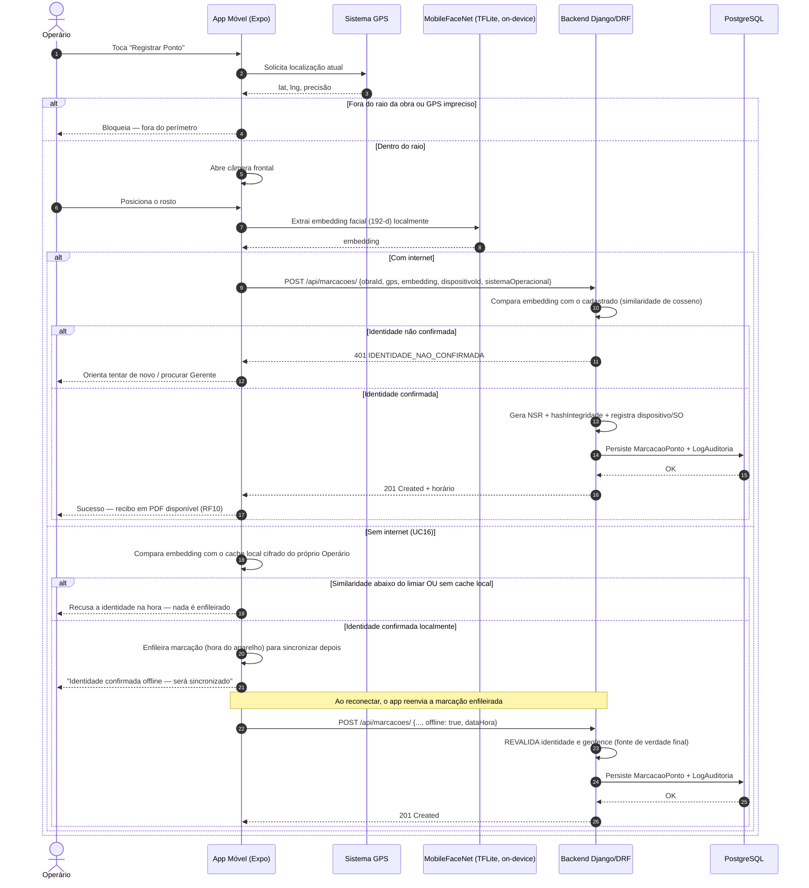
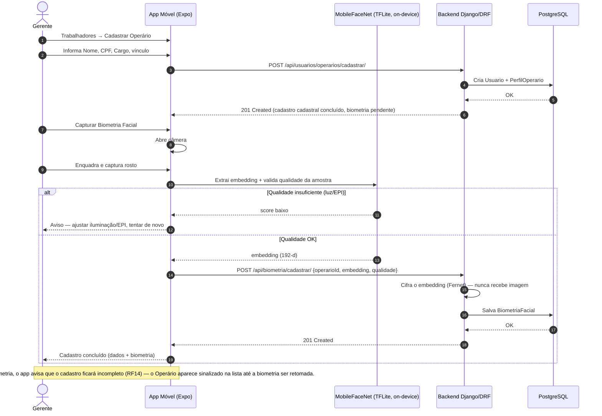
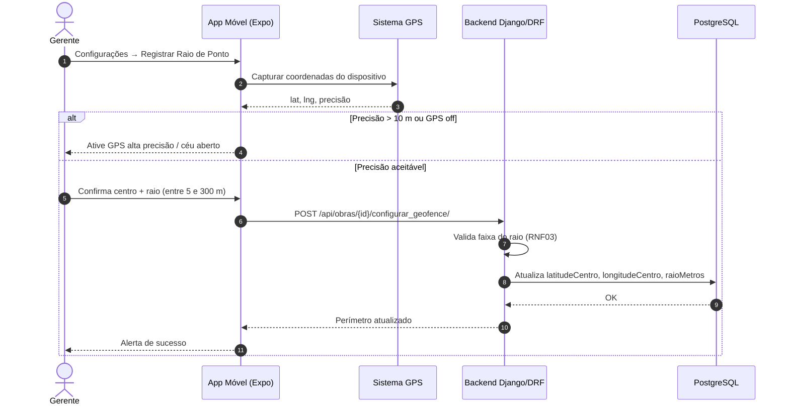
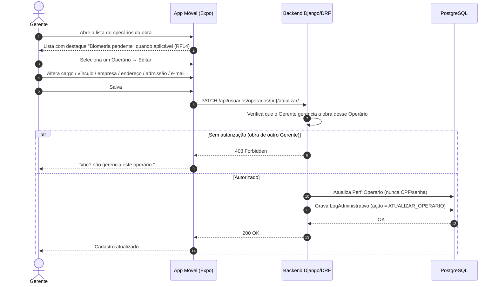
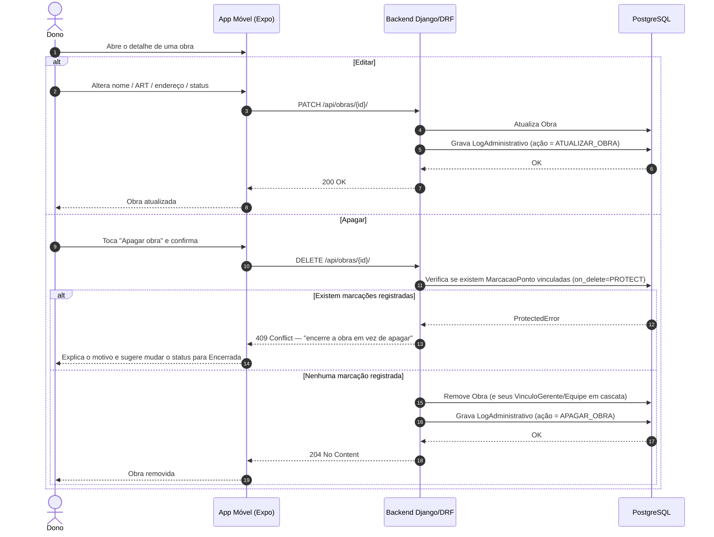

# Diagramas de Sequência — BuildPoint ID

**Versão:** 1.1 (pós-Etapa 3 — stack real e dois fluxos novos)

Mínimo exigido pela Etapa 3: 2 diagramas. Esta revisão troca **Node.js/Firebase** por **Django REST Framework/PostgreSQL** (a stack de fato implementada desde a v1.2 do documento de requisitos) em todos os diagramas já existentes, corrige a terminologia ("Peão" → "Operário"), detalha a validação offline real (que a v1.0 tratava de forma genérica como "grava criptografado") e acrescenta **dois diagramas novos** (SQ04 e SQ05), cobrindo os requisitos RF14/RF15 que não existiam na primeira versão. Total: **5 fluxos**.

---

## SQ01 — Registrar Ponto Eletrônico (Operário)

**Caso de uso:** UC06, UC16 · **Requisitos:** RF07, RF08, RF17, RF21, RNF02, RNF03, RNF04, RNF16

---

## SQ02 — Cadastrar Operário com Biometria (Gerente)

**Caso de uso:** UC05 · **Requisitos:** RF05, RF14, RNF09, RNF15, RNF16

---

## SQ03 — Configurar Raio de Ponto / Geofencing (Gerente)

**Caso de uso:** UC04 · **Requisitos:** RF04, RNF03

---

## SQ04 — Editar Operário (Gerente) — *novo nesta revisão*

**Caso de uso:** UC14 · **Requisitos:** RF14

---

## SQ05 — Editar ou Excluir Obra (Dono) — *novo nesta revisão*

**Caso de uso:** UC15 · **Requisitos:** RF15

---

## Objetos e mensagens (resumo)

| Diagrama | Objetos | Mensagens-chave |
| :--- | :--- | :--- |
| SQ01 | Operário, App, GPS, MobileFaceNet (TFLite), API, PostgreSQL | validar raio → extrair embedding on-device → validar (online ou localmente offline) → persistir log imutável |
| SQ02 | Gerente, App, MobileFaceNet (TFLite), API, PostgreSQL | cadastrar dados → capturar → extrair embedding → cifrar → persistir sem imagem |
| SQ03 | Gerente, App, GPS, API, PostgreSQL | capturar GPS → definir raio (5–300 m) → atualizar obra |
| SQ04 | Gerente, App, API, PostgreSQL | selecionar operário → editar dados protegendo CPF/senha → log administrativo |
| SQ05 | Dono, App, API, PostgreSQL | editar obra **ou** tentar apagar → bloqueio se já houver marcações → log administrativo |
