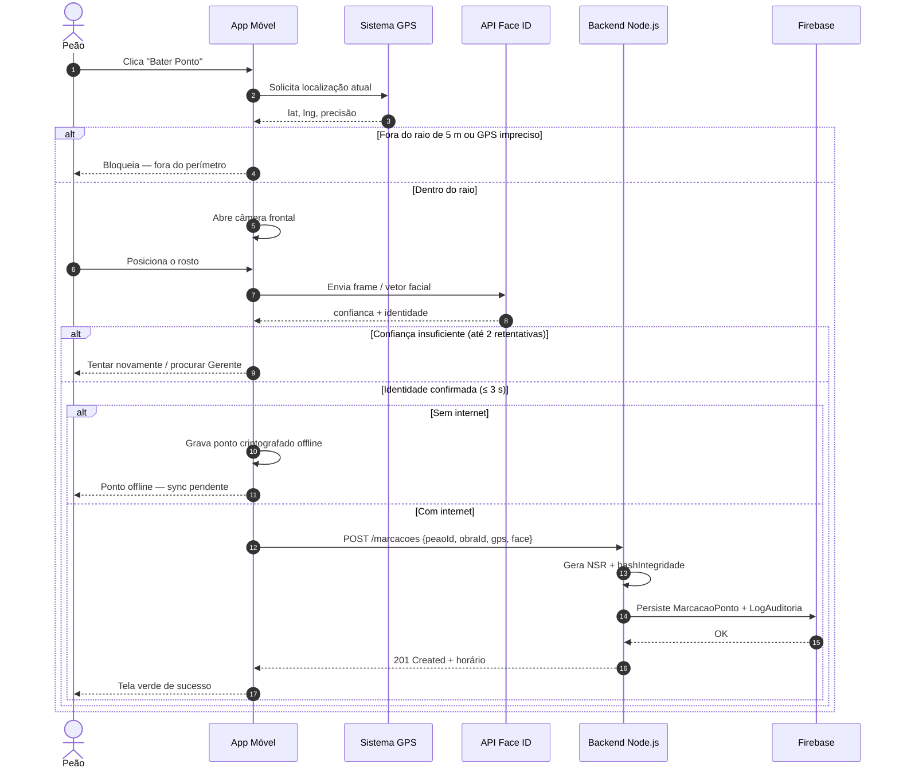
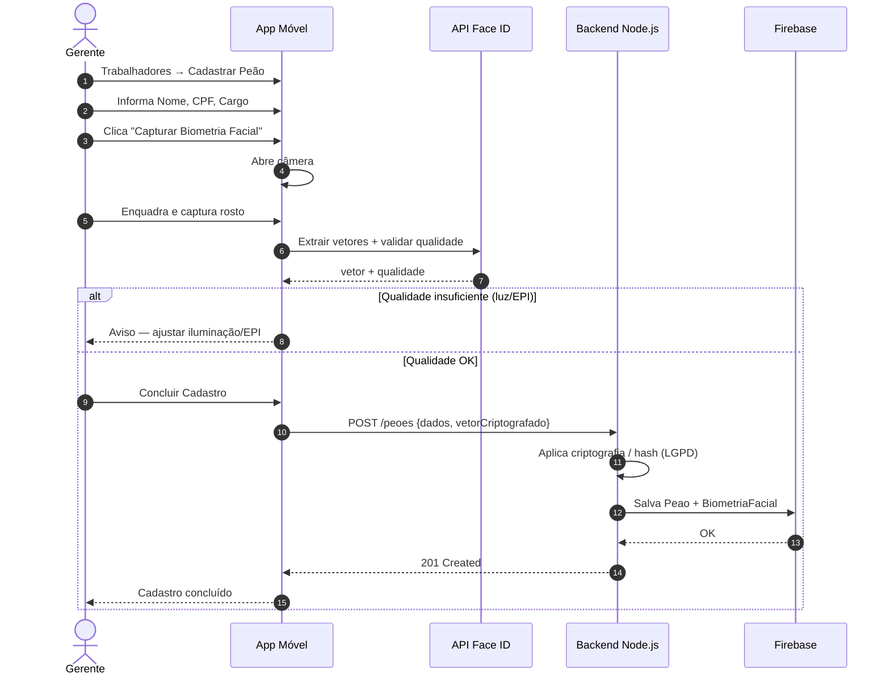
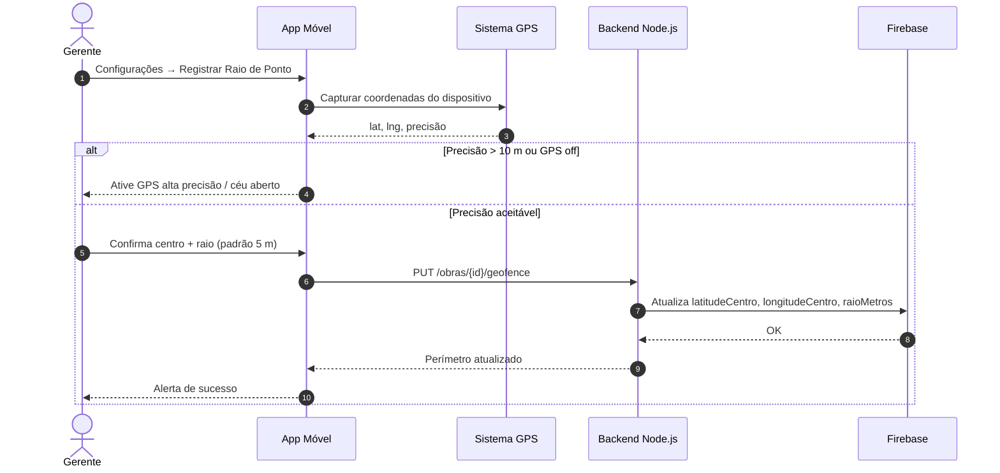

# Diagramas de Sequência — BuildPoint ID

Mínimo exigido pela Etapa 3: **2 diagramas**. Incluímos 3 fluxos críticos do MVP.

---

## SQ01 — Registrar Ponto Eletrônico (Peão)

**Caso de uso:** UC06 · **Requisitos:** RF07, RF08, RNF02, RNF03, RNF04, RS03

---

## SQ02 — Cadastrar Peão com Biometria (Gerente)

**Caso de uso:** UC05 · **Requisitos:** RF05, RS02, RNF02

---

## SQ03 — Configurar Raio de Ponto / Geofencing (Gerente)

**Caso de uso:** UC04 · **Requisitos:** RF04, RNF03

---

## Objetos e mensagens (resumo)

| Diagrama | Objetos | Mensagens-chave |
| :--- | :--- | :--- |
| SQ01 | Peão, App, GPS, Face ID, API, Firebase | validar raio → reconhecer face → persistir log imutável |
| SQ02 | Gerente, App, Face ID, API, Firebase | capturar → extrair vetor → persistir sem imagem pura |
| SQ03 | Gerente, App, GPS, API, Firebase | capturar GPS → definir raio → atualizar obra |
