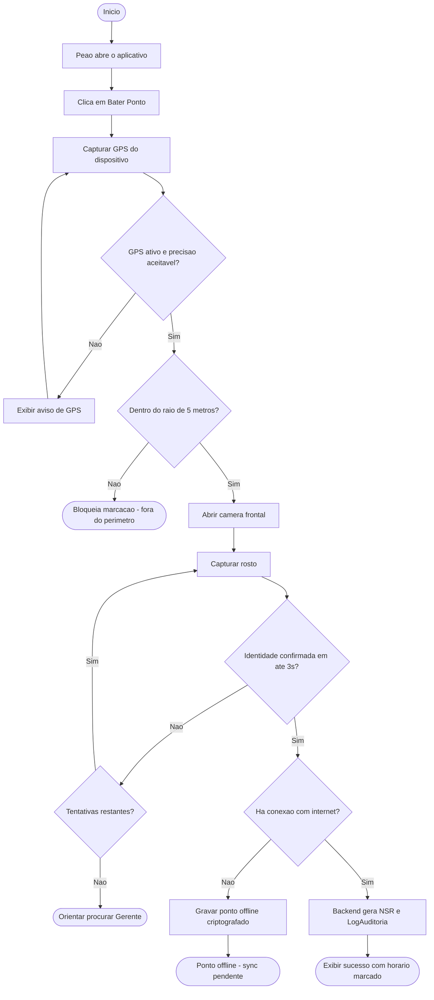
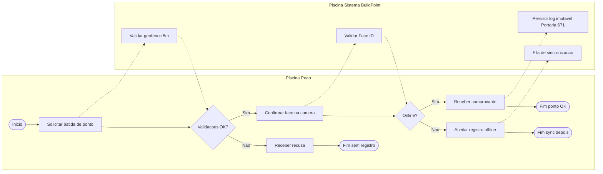

# Diagrama de Atividades / BPMN — BuildPoint ID

Processo modelado: **Registro de ponto eletrônico no canteiro** (fluxo ponta a ponta do MVP).

---

## AT01 — Fluxo de registro de ponto (UML Activity)

---

## BPMN01 — Processo “Bater Ponto” (visão de negócio)

---

## Descrição do processo

| Etapa | Responsável | Decisão / resultado |
| :--- | :--- | :--- |
| 1. Solicitar batida | Peão | Inicia o processo (≤ 2 cliques — RNF05) |
| 2. Validar GPS | Sistema | Bloqueia se fora de 5 m ou GPS ruim |
| 3. Validar Face ID | Sistema + API Face | Até 3 s; até 2 retentativas |
| 4a. Contingência | Gerente | Se face falhar após retentativas |
| 4b. Offline | App | Grava local e sincroniza depois |
| 4c. Online | Backend | NSR + log imutável no Firebase |
| 5. Comprovante | Peão | Feedback visual de sucesso |

## Lanes (BPMN)

1. **Peão** — inicia e recebe feedback;
2. **Sistema BuildPoint** — geofence, Face ID, persistência e sync;
3. **Gerente** (extensão) — contingência quando a face falha.
