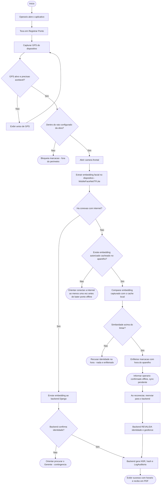
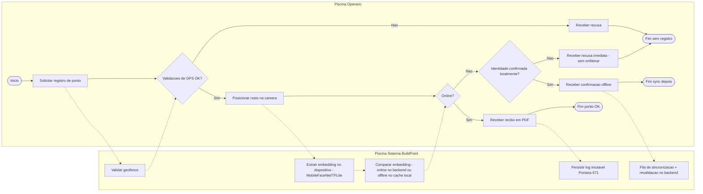

# Diagrama de Atividades / BPMN — BuildPoint ID

**Versão:** 1.1 (pós-Etapa 3 — stack real e ramo offline detalhado)

Processo modelado: **Registro de ponto eletrônico no canteiro** (fluxo ponta a ponta do MVP). Esta revisão corrige a terminologia ("Peão" → "Operário") e substitui o backend Node.js/Firebase por Django/PostgreSQL (RF07, RF08, RNF04). O ramo offline deixa de ser um único passo genérico "gravar criptografado" e passa a refletir o que foi de fato implementado: o app **valida a identidade localmente antes de decidir se enfileira algo** (RF21) — uma pessoa não cadastrada é recusada na hora, mesmo sem internet, em vez de ficar pendente até a sincronização.

---

## AT01 — Fluxo de registro de ponto (UML Activity)

---

## BPMN01 — Processo "Registrar Ponto" (visão de negócio)

---

## Descrição do processo

| Etapa | Responsável | Decisão / resultado |
| :--- | :--- | :--- |
| 1. Solicitar registro | Operário | Inicia o processo (≤ 2 cliques — RNF05) |
| 2. Validar GPS | Sistema | Bloqueia se fora do raio configurado ou GPS ruim |
| 3. Extrair embedding | App (on-device) | Roda localmente em qualquer cenário, online ou offline (RNF16) |
| 4a. Online | Backend | Compara o embedding, gera NSR + log imutável, emite recibo em PDF |
| 4b. Offline — sem correspondência | App | Recusa a identidade **na hora**, sem enfileirar nada (RF21) |
| 4c. Offline — identidade confirmada | App + Backend | Enfileira com a hora do aparelho; backend revalida ao sincronizar e é quem decide de verdade |
| 4d. Falha online | Gerente | Contingência presencial (confirmação imediata) ou, se o Operário nem tinha o app disponível, contingência em papel (lançamento retroativo) |
| 5. Comprovante | Operário | Recibo em PDF, baixado de forma autenticada |

## Lanes (BPMN)

1. **Operário** — inicia e recebe feedback, inclusive offline;
2. **Sistema BuildPoint** — extração de embedding on-device, geofence, comparação (online ou local) e persistência/sync;
3. **Gerente** (extensão, fora deste diagrama) — contingência presencial ou em papel quando a validação automática não é possível.
