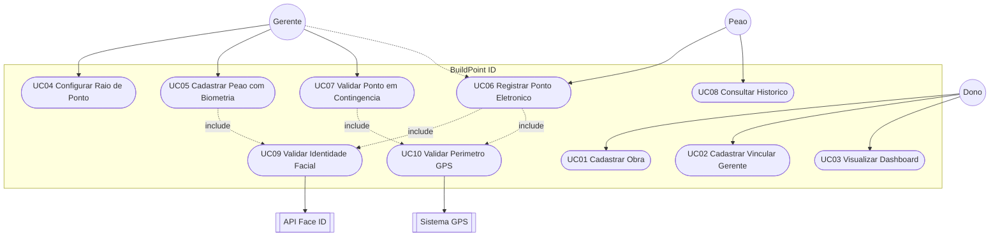

# Diagrama de Casos de Uso — BuildPoint ID

Coerente com a Etapa 2 (atores Dono, Gerente, Peão + Face ID e GPS).

## Versão Mermaid (GitHub / Markdown)

## Lista de casos de uso

| ID | Nome | Ator principal |
| :--- | :--- | :--- |
| UC01 | Cadastrar Obra | Dono |
| UC02 | Cadastrar / Vincular Gerente | Dono |
| UC03 | Visualizar Dashboard | Dono |
| UC04 | Configurar Raio de Ponto | Gerente |
| UC05 | Cadastrar Peão com Biometria | Gerente |
| UC06 | Registrar Ponto Eletrônico | Peão |
| UC07 | Validar Ponto em Contingência | Gerente |
| UC08 | Consultar Histórico de Dias Trabalhados | Peão |
| UC09 | Validar Identidade Facial | API Face ID |
| UC10 | Validar Perímetro GPS | Sistema GPS |
