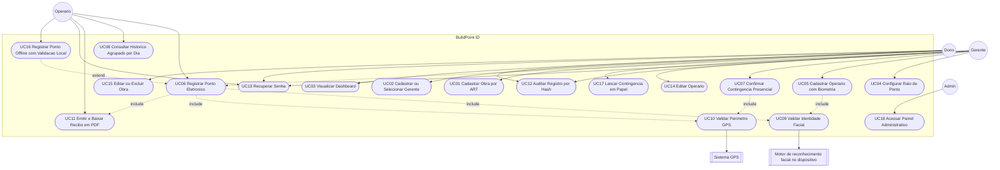

# Diagrama de Casos de Uso — BuildPoint ID

**Versão:** 1.1 — mantido idêntico ao diagrama do §4 de [`../01-documento-de-requisitos.md`](../01-documento-de-requisitos.md), para não existirem duas versões divergentes do mesmo caso de uso. Qualquer alteração de caso de uso deve ser feita nos dois lugares na mesma revisão.

Revisão desta versão: terminologia "Peão" → **Operário**; ator **Admin** adicionado (papel de suporte técnico, sem tela no app); oito casos de uso novos (UC14–UC18, além de UC07/UC08 redefinidos) cobrindo edição de operário/obra, validação de ponto offline, contingência em papel e acesso administrativo — ver histórico de mudanças no documento de requisitos, §1.4.

## Versão Mermaid (GitHub / Markdown)

## Lista de casos de uso

| ID | Nome | Ator principal |
| :--- | :--- | :--- |
| UC01 | Cadastrar Obra por ART | Dono |
| UC02 | Cadastrar / Selecionar Gerente | Dono |
| UC03 | Visualizar Dashboard | Dono |
| UC04 | Configurar Raio de Ponto | Gerente |
| UC05 | Cadastrar Operário com Biometria | Gerente |
| UC06 | Registrar Ponto Eletrônico | Operário |
| UC07 | Confirmar Contingência Presencial | Gerente |
| UC08 | Consultar Histórico Agrupado por Dia | Operário |
| UC09 | Validar Identidade Facial | Motor de reconhecimento facial |
| UC10 | Validar Perímetro GPS | Sistema GPS |
| UC11 | Emitir e Baixar Recibo em PDF | Operário |
| UC12 | Auditar Registro por Hash | Dono, Gerente |
| UC13 | Recuperar Senha | Dono, Gerente, Operário |
| UC14 | Editar Operário | Gerente |
| UC15 | Editar ou Excluir Obra | Dono |
| UC16 | Registrar Ponto Offline com Validação Local | Operário |
| UC17 | Lançar Contingência em Papel | Gerente |
| UC18 | Acessar Painel Administrativo | Admin |

As especificações textuais completas (pré/pós-condições, fluxo principal e alternativos) de cada caso de uso estão em [`../01-documento-de-requisitos.md`](../01-documento-de-requisitos.md), §8.
